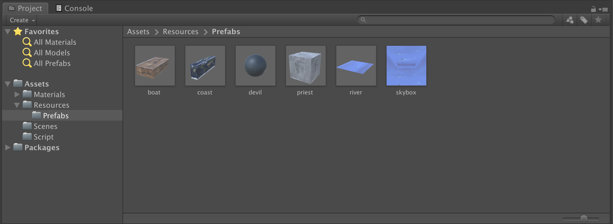
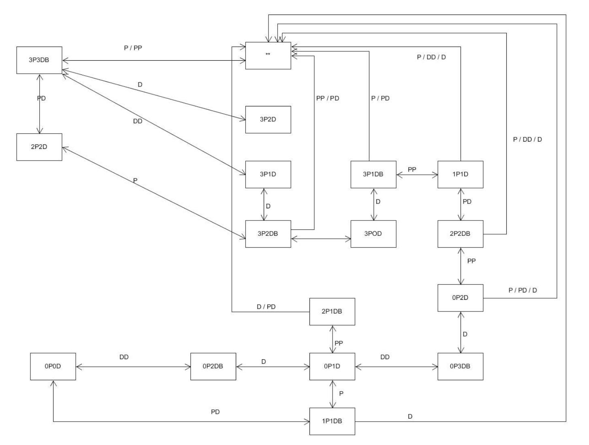
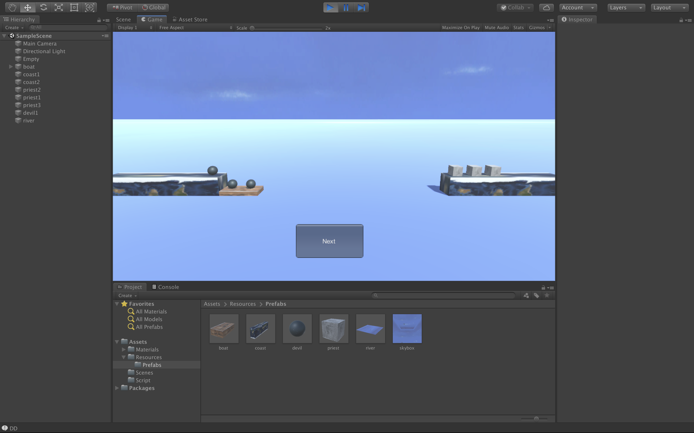

# 3D Game 10 - 游戏智能

> ***冰雪净聪明，雷霆走精锐***
>
> *— 【唐】杜甫 《送樊二十三侍御赴汉中判官》*

## README

**博客地址：** https://sentimentalswordsman.github.io/2019/12/06/3dG10-游戏智能/

**视频地址：** https://www.bilibili.com/video/av78405322/

## 游戏智能

### 游戏智能与AI

#### 游戏智能与人工智能的区别

**游戏智能**，尽管没有权威的定义，但可以理解为：在游戏规则约束下，通过适当的 **算法** 使得游戏中 NPC（Non-Player Character） 呈现为具有一定人类智能行为的 **博弈对手**，让游戏玩家面临不间断的 **挑战**，并在挑战中有所收获，包括知识和技能等。

因此，游戏智能与人工智能在设计目标上有着比较大的不同：

- 拟人化。游戏智能更注重游戏对象行为结果类似（模拟）人，既能做出令人惊讶的有效行为，也会犯各种愚笨的错误，从而与现实世界中不同的人匹配。而人工智能通常是超人设计，追求最佳结果。
- 可玩性。游戏智能并不意味着高大上的算法，它更注重针对不同类型的玩家设计不同能力的 NPC，例如：“小怪物”，“大boss” 等等，通常用等级这个参数来表达游戏智能 agent 的能力。
- 趣味性。游戏智能设计注重娱乐，而不只是算法研究。因此，算法会集合一些特效，让人感到愉悦。

### 模型、方法与常用算法

#### “感知-思考-行为”模型

**“sense-think-act” paradigm（范式）** 是构造 agent、robot、NPC（Non-Player Character） 的基础概念。自从上世纪80年代提出以来，我们使用 Sense-Think-Act 范例思考机器人如何工作，并设计它们。 即使机器人最终设计的方式不同，STA 通常仍然是一个有用的开始。 随着机器人技术的发展，协同技术越来越重要，机器人之间的 “Communicate”通常也纳入设计之中。本节主要关注 NPC 如何产生看似理性（Rational）的行为（模拟人）的设计方法。

## 作业与练习：UI 效果制作

### 作业要求

P&D 过河游戏智能帮助实现，程序具体要求：

- 实现状态图的自动生成
- 讲解图数据在程序中的表示方法
- 利用算法实现下一步的计算

### 预期目标

1. 实现牧师与魔鬼游戏界面和过程
2. 可以使用Next按键完成游戏智能上下船的过程
3. 可以模拟整个游戏过程

### 项目设计

**目录结构**



**状态图生成**



　该状态图只记录了游戏过程中左岸的情况。P代表牧师，D代表魔鬼，B代表船。当船在右岸时不记录。双箭头代表两个状态可以相互转化。 实现AI的基本原理是：点击next之后，分析当前场景的状态，读取成功路径上的下一个状态，执行相应动作以达到下一个状态。 基于以上原理，我们可以按如下方式实现。首先，根据当前的状态，分析接下来需要执行的一个动作。

### 完成情况

**游戏界面**



**代码设计**

使用hw4的牧师与魔鬼动作分离版来拓展出本次状态机版本的牧师与魔鬼游戏，动作分离版中设计一个了裁判类，当游戏达到结束条件时，通知场景控制器游戏结束，再加入StateMachine类来完成状态图的转换，关键代码如下：

Action.cs

```C#
using System;
using System.Collections;
using System.Collections.Generic;
using UnityEngine;
using Interfaces;

public class Action : SSActionManager, SSActionCallback
{
    public SSActionEventType comp = SSActionEventType.Completed;
    //  船的运动
    public void BoatMove(BoatSceneController boat)
    {
        // Debug.Log(boat.GetState());
        comp = SSActionEventType.Started;
        CCMoveToAction action = CCMoveToAction.getAction(boat.GetDestination(), boat.GetSpeed());
        addAction(boat.GetGameobject(), action, this);
        boat.ChangeState();
    }
    //  牧师和魔鬼的运动
    public void GameObjectsMove(GameObjects Object, Vector3 dest)
    {
        comp = SSActionEventType.Started;
        Vector3 pos1 = Object.getPosition();
        Vector3 pos2 = Object.getPosition();
        if (dest.y <= pos2.y)
        {
            pos2.x = dest.x;
        }
        else
        {
            pos2.y = dest.y;
        }
        SSAction action1 = CCMoveToAction.getAction(pos2, Object.getSpeed());
        SSAction action2 = CCMoveToAction.getAction(dest, Object.getSpeed());
        SSAction seq = CCSequenceAction.getAction(1, 0, new List<SSAction> { action1, action2 });
        this.addAction(Object.GetGameobject(), seq, this);
    }
    //  SSActionCallback
    public void SSActionCallback(SSAction source)
    {
        comp = SSActionEventType.Completed;
    }
}
```

FirstController.cs

```C#
using System.Collections;
using System.Collections.Generic;
using UnityEngine;
using Interfaces;

public class FirstController : MonoBehaviour, ISceneController, UserAction
{
    private GameObjects[] GameObjects;
    // InteracteGUI UserGUI;
    public CoastSceneController coast1;
    public CoastSceneController coast2;
    public BoatSceneController boat;
    private Action action;
    public StateMachine stateMachine;

    void Awake()
    {
        //  GetComponent 需在外添加组件
        action = GetComponent<Action>();
        SSDirector director = SSDirector.getInstance();
        director.setFPS(60);
        director.currentScenceController = this;
        //  GameObjects 存放三个牧师与三个魔鬼
        // UserGUI = gameObject.AddComponent<InteracteGUI>() as InteracteGUI;
        GameObjects = new GameObjects[6];
        //  直接调用 FirstController 中的 LoadResources()
        //  director.currentScenceController.LoadResources();
        LoadResources();
    }

    public void LoadResources()
    {   
        GenGameObjects();
    }

    public void GenGameObjects()
    {
        //  boat
        boat = new BoatSceneController();
        //  coast
        coast1 = new CoastSceneController(1);
        coast2 = new CoastSceneController(2);
        //  priests and devils
        //  type: p-1, d-0
        for (int i = 0; i < 6; i++)
        {
            GameObjects s;
            if (i < 3)
            {
                s = new GameObjects(1); // priests
            }
            else
            {
                s = new GameObjects(0); // devils
            }
            s.setName(i);
            //  放在第一个河岸上
            s.setPosition(coast1.getEmptyPosition());
            s.getOnCoast(coast1);
            coast1.getOnCoast(s);
            GameObjects[i] = s;
        }
        //  river
        //  直接生成预制体Prefabs
        GameObject river = Object.Instantiate(Resources.Load<GameObject>("Prefabs/river"), new Vector3(0, 0.5F, 0), Quaternion.identity); 
        river.name = "river";
        StateMachine.stateMachine.first_controller = this;
    }

    public void ClickBoat()
    {
        if (action.comp == SSActionEventType.Started || boat.isEmpty())
            return; // if (boat.isEmpty()) return;
        action.BoatMove(boat); // boat.boatMove();
        //  每次开船后检查一次胜负
        // UserGUI.SetState = Check();
    }

    public void ClickObject(GameObjects PorD)
    {
        if (action.comp == SSActionEventType.Started)
            return;
        //  下船
        if (PorD.isOnBoat())
        {
            CoastSceneController coast;
            //  boat 1-coast1, 2-coast2
            if (boat.GetState() == 1)
            {
                coast = coast1;
            }
            else
            {
                coast = coast2;
            }
            boat.GetOffBoat(PorD.getName());
            action.GameObjectsMove(PorD, coast.getEmptyPosition());
            //  PorD.moveToPosition(coast.getEmptyPosition());
            PorD.getOnCoast(coast);
            coast.getOnCoast(PorD);
        }
        //  上船
        else
        {                                   
            CoastSceneController coast = PorD.getCoastSceneController();
            //  船上没位置或者船不在这边，什么都不做
            if (boat.getEmptyIndex() == -1 || coast.GetState() != boat.GetState())
            {   
                return;
            }
            coast.getOffCoast(PorD.getName());
            action.GameObjectsMove(PorD, boat.getEmptyPosition());
            //  PorD.moveToPosition(boat.getEmptyPosition());
            PorD.getOnBoat(boat);
            boat.GetOnBoat(PorD);
        }
        //  在游戏胜利的条件下，不用开船也应该检查出胜负
        // UserGUI.SetState = Check();
    }

    int Check()
    {
        // 0-play, 1-win, 2-lose
        int p_coast1_num = 0;
        int d_coast1_num = 0;
        int p_coast2_num = 0;
        int d_coast2_num = 0;
        int[] coast1_arr = coast1.GetobjectsNumber();
        int[] coast2_arr = coast2.GetobjectsNumber();
        int[] boat_arr = boat.GetobjectsNumber();
        //  分别计算两侧岸上的人数
        d_coast1_num += coast1_arr[0];
        p_coast1_num += coast1_arr[1];
        d_coast2_num += coast2_arr[0];
        p_coast2_num += coast2_arr[1];
        //  判断是否胜利
        if (p_coast2_num + d_coast2_num == 6)      // win
            return 1;
        //  计算船上人数，累加进累加器
        if (boat.GetState() == 1)
        {
            d_coast1_num += boat_arr[0];
            p_coast1_num += boat_arr[1];
        }
        else
        {
            d_coast2_num += boat_arr[0];
            p_coast2_num += boat_arr[1];
        }
        //  判断是否失败
        //  检查coast1
        if (p_coast1_num < d_coast1_num && p_coast1_num > 0)
        {
            return 2;
        }
        //  检查coast2
        if (p_coast2_num < d_coast2_num && p_coast2_num > 0)
        {
            return 2;
        }
        return 0;
    }

    public void NextStep()
    {
        StateMachine.stateMachine.move();
    }

    public void Restart()
    {
        // 重置每个对象
        boat.Reset();
        coast1.Reset();
        coast2.Reset();
        for (int i = 0; i < GameObjects.Length; i++)
        {
            GameObjects[i].Reset();
        }
        StateMachine.stateMachine.restart();
    }
}
```

StateMachine.cs

```C#
using Interfaces;
using UnityEngine;
using System.Threading;
using System.Collections;
using System.Collections.Generic;

public class StateMachine
{
    public static StateMachine stateMachine = new StateMachine();
    private enum OnBoat {empty, P, D, PP, DD, PD }
    public FirstController first_controller;
    private OnBoat nextOnBoat;
    private bool flag = true;
    // coast1-1,coast2-2
    private int count = 0;
    private int num = 0;
    private int ThisCoast;
    private int D_count;
    private int P_count;

    private StateMachine() {}

    public void move()
    {
        if (flag)
        {
            int[] coast1_num = first_controller.coast1.GetobjectsNumber();
            P_count = coast1_num[1];
            D_count = coast1_num[0];
            ThisCoast = first_controller.boat.GetState();
            if (count == 0)
            {
                nextOnBoat = getNextState();
                if ((int)nextOnBoat >= 3)
                    num = 2;
                else if ((int)nextOnBoat > 0)
                    num = 1;
                else
                    num = 0;
                count++;
            }
            Debug.Log(nextOnBoat);
            flag = false;
            getNextMove();
        }
    }

    public void restart()
    {
        count = 0;
        num = 0;
    }

    private void getNextMove()
    {
        if (num != 0 && count == 1)
        {
            if (nextOnBoat == OnBoat.D || nextOnBoat == OnBoat.DD)
            {
                D_boat();
            }
            else if (nextOnBoat == OnBoat.P || nextOnBoat == OnBoat.PP || nextOnBoat == OnBoat.PD)
            {
                P_boat();
            }
        }
        else if (num == 2 && count == 2)
        {
            if (nextOnBoat == OnBoat.DD || nextOnBoat == OnBoat.PD)
            {
                D_boat();
            }
            else if (nextOnBoat == OnBoat.PP)
            {
                P_boat();
            }
        }
        else if((num == 1 && count == 2) || (num == 2 && count == 3) || (num == 0 && count == 1))
        {
            first_controller.ClickBoat();
        }
        else if ((num == 1 && count >= 3) || (num == 2 && count >= 4) || (num == 0 && count >= 2))
        {
            OverMove();
            count--;
        }
        flag = true;
        count++;
    }

    private void OverMove()
    {
        if((P_count == 0 && D_count == 2) || (P_count == 0 && D_count == 0))
        {
            if (first_controller.boat.GetState() == 1)
                count = 0;
            else
            {
                foreach (var x in first_controller.boat.objectsOnBoat)
                {
                    if (x != null)
                    {
                        first_controller.ClickObject(x);
                        break;
                    }
                }
                if (first_controller.boat.isEmpty())
                    count = 0;
            }
        }
        else if (P_count == 0 && D_count == 1 && first_controller.boat.GetState() == 1)
        {
            count = 0;
        }
        else
        {
            foreach (var x in first_controller.boat.objectsOnBoat)
            {
                if (x != null && x.getType() == 0)
                {
                    first_controller.ClickObject(x);
                    count = 0;
                    break;
                }
            }
            if (count != 0)
            {
                foreach (var x in first_controller.boat.objectsOnBoat)
                {
                    if (x != null)
                    {
                        first_controller.ClickObject(x);
                        count = 0;
                        break;
                    }
                }
            }
        }
    }

    private OnBoat getNextState()
    {
        Debug.Log("DC:" + D_count);
        Debug.Log("PC:" + P_count);
        OnBoat next = OnBoat.empty;
        if (ThisCoast == 1)
        {
            if ((D_count == 3 && P_count == 3) || (D_count == 1 && P_count == 1))
            {
                next = OnBoat.PD;
            }
            else if ((D_count == 2 && P_count == 3) || (D_count == 3 && P_count == 0))
            {
                next = OnBoat.DD;
            }
            else if ((D_count == 1 && P_count == 3) || (D_count == 2 && P_count == 2))
            {
                next = OnBoat.PP;
            }
            else if ((D_count == 1 && P_count == 2) || (D_count == 2 && P_count == 1))
            {
                next = OnBoat.P;
            }
            else if ((D_count == 1 && P_count == 0) || (D_count == 3 && P_count == 2) || (D_count == 2 && P_count == 0))
            {
                Debug.Log("sssss");
                next = OnBoat.D;
            }
            else
                next = OnBoat.empty;
        }
        else
        {
            if ((D_count == 2 && P_count == 2) || (D_count == 1 && P_count == 3) || (D_count == 0 && P_count == 3) || (D_count == 1 && P_count == 0))
            {
                next = OnBoat.empty;
            }
            else if ((D_count == 2 && P_count == 3) || (D_count == 1 && P_count == 1) || (D_count == 2 && P_count == 0))
            {
                Debug.Log("sssss2");
                next = OnBoat.D;
            }
            else
                next = OnBoat.empty;
        }
        return next;
    }

    private void P_boat()
    {
        if(ThisCoast == 1)
        {
            foreach(var x in first_controller.coast1.obejcts)
            {
                if (x != null && x.getType() == 1)
                {
                    first_controller.ClickObject(x);
                    return;
                }
            }
        }
        else if(ThisCoast == 2)
        {
            foreach (var x in first_controller.coast2.obejcts)
            {
                if (x != null && x.getType() == 1)
                {
                    first_controller.ClickObject(x);
                    return;
                }
            }
        }
    }

    private void D_boat()
    {
        if (ThisCoast == 1)
        {
            foreach (var x in first_controller.coast1.obejcts)
            {
                if (x != null && x.getType() == 0)
                {
                    first_controller.ClickObject(x);
                    return;
                }
            }
        }
        else
        {
            foreach (var x in first_controller.coast2.obejcts)
            {
                if (x != null && x.getType() == 0)
                {
                    first_controller.ClickObject(x);
                    return;
                }
            }
        }
    }
}
```

Judge.cs

```C#
using System.Collections;
using System.Collections.Generic;
using UnityEngine;
using Interfaces;

public class Judge : MonoBehaviour
{
    public int state;
    InteracteGUI UserGUI;
    private FirstController FC;

    void Awake()
    {
        state = 0; 
        UserGUI = gameObject.AddComponent<InteracteGUI>() as InteracteGUI;
        FC = GetComponent<FirstController>();
    }

    void Update()
    {
        Check();
        // Debug.Log("state: " + state);
        UserGUI.SetState = state;
    }

    public void setState(int sta)
    {
        state = sta;
    }

    public int getState()
    {
        return state;
    }

    public void Check()
    {
        // 0-play, 1-win, 2-lose
        int p_coast1_num = 0;
        int d_coast1_num = 0;
        int p_coast2_num = 0;
        int d_coast2_num = 0;
        int[] coast1_arr = FC.coast1.GetobjectsNumber();
        int[] coast2_arr = FC.coast2.GetobjectsNumber();
        int[] boat_arr = FC.boat.GetobjectsNumber();
        //  分别计算两侧岸上的人数
        d_coast1_num += coast1_arr[0];
        p_coast1_num += coast1_arr[1];
        d_coast2_num += coast2_arr[0];
        p_coast2_num += coast2_arr[1];
        //  判断是否胜利
        if (p_coast2_num + d_coast2_num == 6)      // win
        {
            state = 1;
            return;
        }
        //  计算船上人数，累加进累加器
        if (FC.boat.GetState() == 1)
        {
            d_coast1_num += boat_arr[0];
            p_coast1_num += boat_arr[1];
        }
        else
        {
            d_coast2_num += boat_arr[0];
            p_coast2_num += boat_arr[1];
        }
        //  判断是否失败
        //  检查coast1
        if (p_coast1_num < d_coast1_num && p_coast1_num > 0)
        {
            state = 2;
            return;
        }
        //  检查coast2
        if (p_coast2_num < d_coast2_num && p_coast2_num > 0)
        {
            state = 2;
            return;
        }
        state = 0;
    }
}
```

## 参考资料

[1] [游戏智能_教学讲义](https://pmlpml.github.io/unity3d-learning/10-intelligent.html)

[2] [Maunal](https://docs.unity3d.com/Manual/index.html)

[3]  [讲义_参考网页](https://blog.csdn.net/kiloveyousmile/article/details/71727667)