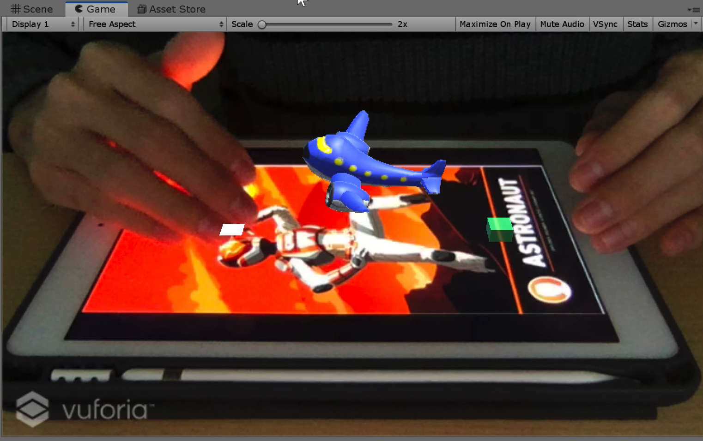
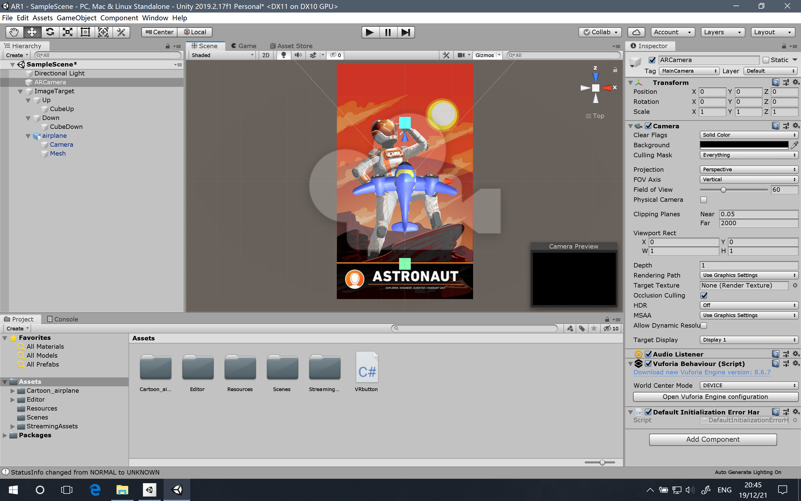
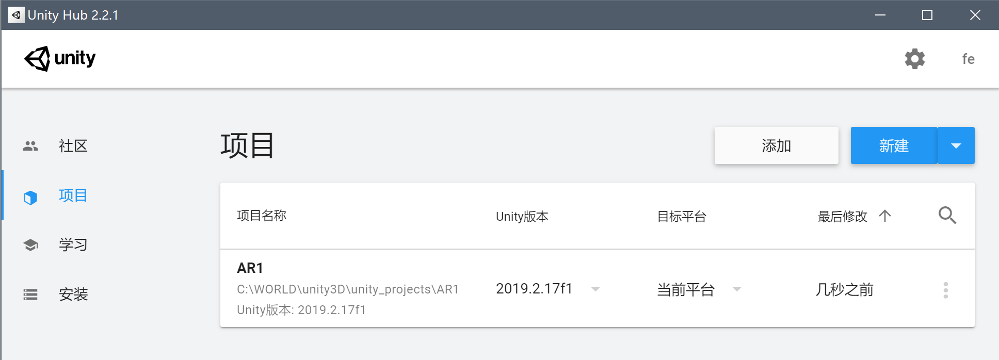
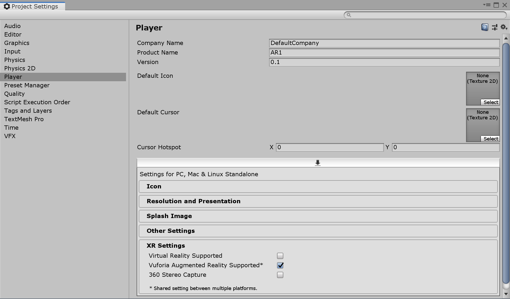
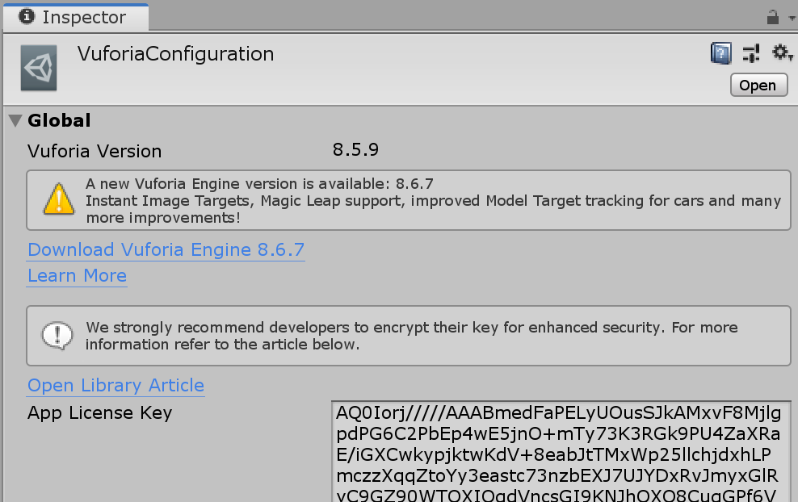
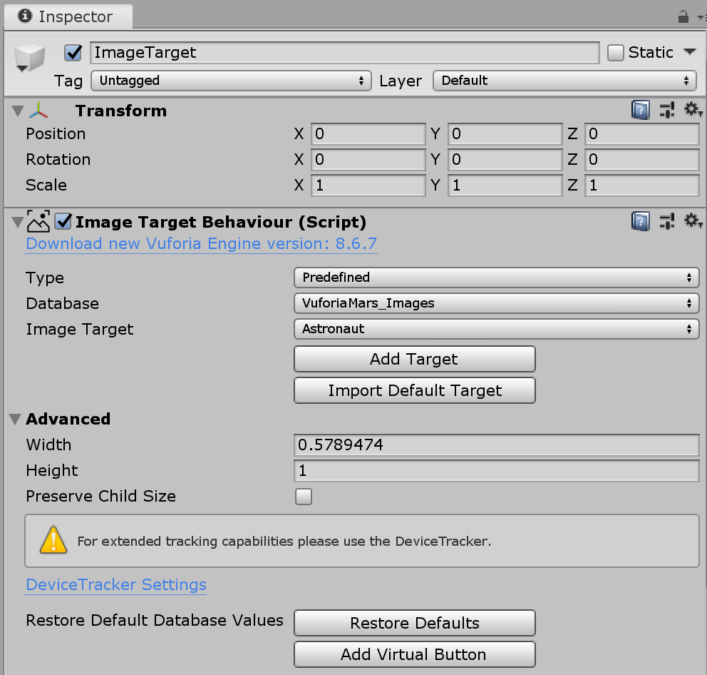
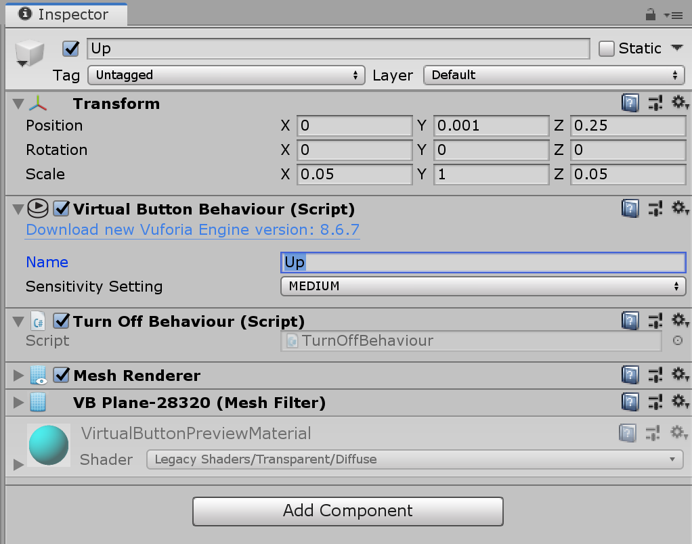
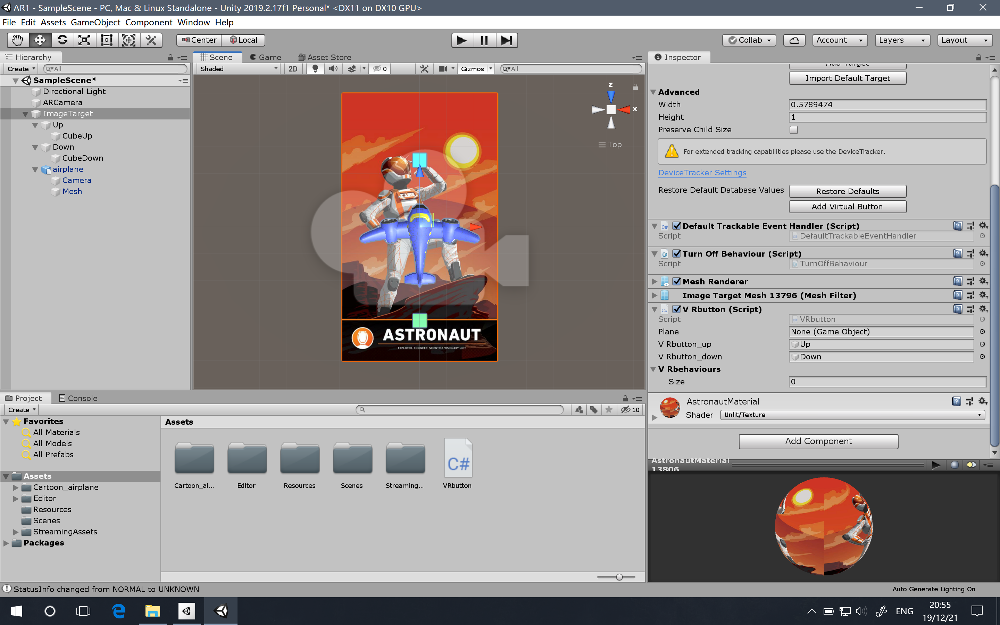

# 3D Game 11 - AR/MR 技术

> ***So keep looking until you find it. Don’t settle.***
>
> *— Steve Jobs, Stanford Report, June 14, 2005*

## README

**博客地址：** https://sentimentalswordsman.github.io/2019/12/19/3dG11-AR-MR技术/

**视频地址：** https://www.bilibili.com/video/av80127226/

## AR/MR 技术

### AR/MR 概述

**[增强现实](https://en.wikipedia.org/wiki/Augmented_reality)**（Argumented Reality (AR)）是一种将真实世界信息和虚拟世界信息“无缝”集成的新技术，是把原本在现实世界的一定时间空间范围内很难体验到的实体信息，通过电脑等科学技术，模拟仿真后再叠加，将虚拟的信息应用到真实世界，被人类感官所感知，从而达到超越现实的感官体验。

**[混合现实](https://en.wikipedia.org/wiki/Mixed_reality)**（Mixed reality (MR)）有时被称为超现实（hybrid reality），是真实和虚拟世界的合并，产生新的可视化环境，物理和数字对象实时共存且在其中交互。混合现实不仅发生在物理世界或虚拟世界中，而是融合了现实和虚拟现实，通过身临其境的技术包含增强现实和增强虚拟。

### VR，AR，MR的区别

- VR，玩家可以通过各种交互技术进入虚拟世界，与虚拟世界事物交互。
- AR，把虚拟世界的物体叠加在现实世界的影像或视频中的物体上，玩家在现实的背景上与虚拟世界物体互动。
- MR，将现实世界事物实时在虚拟世界中重构，这些现实物体、虚拟物体与玩家三者互动。

## 作业与练习： 虚拟按键小游戏

### 作业要求

**游戏具体要求**

- 图片识别与建模
- 实现虚拟按键

### 完成情况

**游戏界面**



### 项目设计

**项目结构**



**工具配置**

为更好地使用 vuforia 工具，最好使用最新的 unity Hub 和 unity 版本。本项目使用的 unity 版本是 2019.2.17f1，此版本自带有 vuforia 工具，使用起来较为方便。



新建 unity 项目后，需先要激活 Vuforia 插件，选择 菜单栏 > Edit > Project Settings > Player，再勾选 “Vuforia Augmented Reality Supported*” 选项即可。激活完成后，可以在 菜单栏 > GameObject > Vuforia 中添加 Vuforia 的物体预设。在 Build Settings 和 Player Settings 可以看到 Vuforia 的配置属性等。



**注册 LicenseKey**

打开 Vuforia 官网，选择 Develop > License Manager，点击 “Get Development Key” 按钮可以获取 License Key，需要填写当前项目名称、阅读相关协议，复制所得的 License Key 后，用于后续使用。

**创建并导入数据库包**

打开 Vuforia 官网，选择 Develop/Target Manager，可以进行数据库的创建，可以选择上传的数据类型为 “Single Image”，即上传图片作为识别的标志，上传成功后，得到的图片星数越多，则识别度越高。完成后下载数据库包，选择 UnityEditor 版，将下载下来的数据库（Unity package包）导入到项目中即可直接使用。

**添加 AR Camera**

选择 菜单栏 > GameObject > Vuforia，添加一个 AR Camera，并删除场景中原来的Main Camera。再选中添加的 AR Camera，在属性面板中点击 “Open Vuforia Configuartion” 可以打开 Vuforia 全局配置面板。

预制 AR Camera 中需要注意，在配置面板里，需要将上述步骤复制好的 License Key 添加到 AR Camera 中，完成匹配。



**添加 ImageTarget**

选择 菜单栏 > GameObject > Vuforia，添加一个 Image Target，作为 AR 显示的识别图，需要将识别图打印或显示在其他设备屏幕上，运行时由摄像机捕捉。

调整好相关参数后，可以往 Image Target 中华添加子对象。首先添加好游戏的主体对象 “airplane” ，然后在 ImageTarget 的属性面板中找到 “Add Virtual Button” 按钮，点击即可添加虚拟按钮，一共添加两个。在本设计中，有两个按钮，一个控制飞机的上升，一个控制飞机的下降，由此完成飞机模型的升降。



虚拟按钮是一块透明的区域，当 Vuforia 的摄像头检测到这个区域一定范围被遮挡时，就会触发事件，事件逻辑由代码编写，检测的范围大小主要由虚拟按钮的 Sensitivity Setting 决定，但是虚拟按钮本身不会显示，可以在每个虚拟按钮下各自添加一个 3D GameObject 对象（Cube 或着 Plane 均可）。需要注意，为实现代码的正确运行，需要在 Virtual Button Behaviour 中给出该虚拟按钮的名称。





**代码设计**

需要完成脚本的编写，赋予虚拟按钮点击触发事件，其中需要完成控制按钮空闲时处理的函数 OnButtonReleased()，以及完成按钮被点击时触发的函数 OnButtonPressed()，需要在 Start() 函数中对 VirtualButtonBehaviour 进行注册。需要注意，脚本需要添加到 Image Target 中才能够生效，代码如下所示：

VRbutton.cs

```C#
using System.Collections;
using System.Collections.Generic;
using UnityEngine;
using Vuforia;
 
public class VRbutton : MonoBehaviour, IVirtualButtonEventHandler
{
    public GameObject plane;
    public GameObject VRbutton_up;
    public GameObject VRbutton_down;
    public VirtualButtonBehaviour[] VRbehaviours;

    void Start()
    {
        VRbehaviours = GetComponentsInChildren<VirtualButtonBehaviour>();
        for (int i = 0; i < VRbehaviours.Length; i++)
        {
            VRbehaviours[i].RegisterEventHandler(this);
        }
        plane = GameObject.Find("airplane");
        VRbutton_up = GameObject.Find("Up");
        VRbutton_down = GameObject.Find("Down");
    }

    void Update()
    {

    }

    public void OnButtonPressed(VirtualButtonBehaviour myButton)
    {        
        switch (myButton.VirtualButtonName)
        {
            case "Up":
                plane.transform.position += new Vector3(0, 0.03f, 0);
                break;
            case "Down":
                plane.transform.position -= new Vector3(0, 0.03f, 0);
                break;
        }
    }
    
    public void OnButtonReleased(VirtualButtonBehaviour myButton)
    {

    }
}
```

## 参考资料

[1] [AR/MR 技术_教学讲义](https://pmlpml.github.io/unity3d-learning/12-AR-and-MR#2ar-sdk-与应用)

[2] [Maunal](https://docs.unity3d.com/Manual/index.html)

[2] [Vuforia](https://developer.vuforia.com)