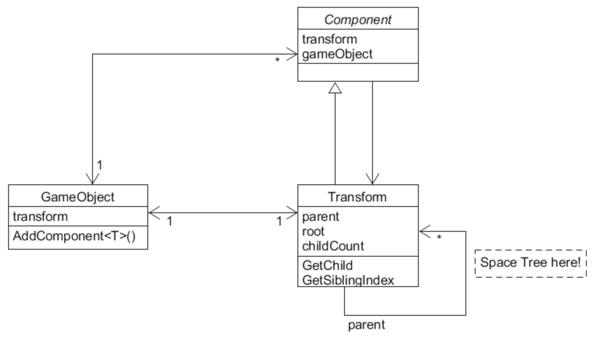
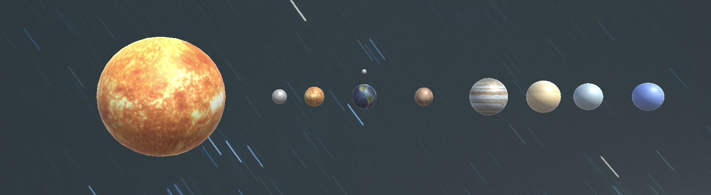
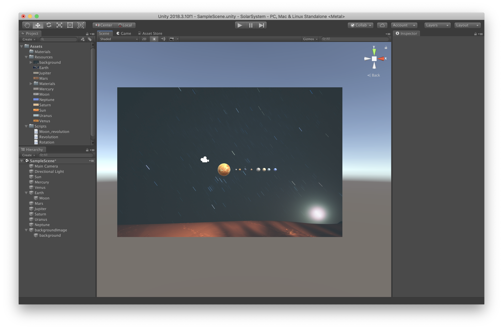

# 3D Game 2 - 离散仿真引擎基础

> **You can’t connect the dots looking forward; you can only connect them looking backwards**
> *— Steve Jobs, Stanford Report, June 14, 2005*

**博客地址**： https://sentimentalswordsman.github.io/2019/09/10/3dG2-离散仿真引擎基础/

**视频链接**： https://www.bilibili.com/video/av67477674/

说明：博客包含简答题、编程实践、选做题；视频为编程实践“井字棋”的展示视频。

### 编程实践-小游戏

#### 游戏内容

**井字棋 Tic-Tac-Toe**：一种在3*3格子上进行的连珠游戏，由分别代表O和X的两个游戏者轮流在格子里留下标记（一般来说先手者为X），任意三个标记形成一条直线，则为获胜。

#### 技术限制

使用 **IMGUI** 构建 UI。

#### 作业目的

- 了解 OnGUI() 事件，提升 debug 能力
- 提升阅读 API 文档能力

#### 完成情况

核心代码如下：

```c#
using System.Collections;
using System.Collections.Generic;
using UnityEngine;
using UnityEngine.UI;

public class TicTacToe : MonoBehaviour
{
    private bool turn;
    private int winner, count;
    private int[, ] state = new int[3, 3];
    private int[, ] map = new int[3, 3];
    private GUIStyle Style = new GUIStyle ();

    void Start() {
        turn = true;
        count = 0;
        //  init
        for (int i = 0; i < 3; i++)
            for (int j = 0; j < 3; j++) {
                state[i, j] = 0;
                map[i, j] = 0;
            }
        //  style init
        Style.fontSize = 32;
        Style.fontStyle = FontStyle.BoldAndItalic;
        Style.normal.textColor = Color.blue;
        Style.alignment = TextAnchor.MiddleCenter;
    }

    void Update() {

    }

    int Check() {
        for (int i = 0; i < 3; i++) {
            //  check for 3 rows
            if (state[i, 0] != 0 && state[i, 0] == state[i, 1] && state[i, 0] == state[i, 2])
                    return state[i, 0];
            //  check for 3 columns
            if (state[0, i] != 0 && state[0, i] == state[1, i] && state[0, i] == state[2, i])
                    return state[0, i];
        }
        //  check for 2 diagonals
        if (state[1, 1] != 0 && state[1, 1] == state[0, 0] && state[1, 1] == state[2, 2])
            return state[1, 1];
        if (state[1, 1] != 0 && state[1, 1] == state[0, 2] && state[1, 1] == state[2, 0])
            return state[1, 1];
        //  check for tie
        if (count == 9)
            return 3;
        //  playing
        return -1;
    }

    string LabelMessage(int check_ans) {
        // label message
        if (check_ans == 1)
            return "Player O is Winner!";
        else if (check_ans == 2)
            return "Player X is Winner!"; 
        else if (check_ans == 3)
            return "Tie!!!";
        else {
            if (turn)
                return "Player O is playing";
            else
                return "Player X is playing";
        }
    }

    string ButtonMessage(int state_ans) {
        //  9 blocks-message
        if (state_ans == 1)
            return "O";
        else if (state_ans == 2)
            return "X";
        else
            return "";
    }

    private void OnGUI() {
        // button for restart
        if (GUI.Button(new Rect(200, 430, 100, 75), "Restart"))
            Start();
        // lable about playing message
        GUI.Label(new Rect(100, 50, 300, 30), LabelMessage(Check()), Style);
        // game loop
        for (int i = 0; i < 3; ++i) {
            for (int j = 0; j < 3; ++j) {
                //  Debug.Log(ButtonMessage(state[i, j]));
                //  Tic-Tac-Toe 9-blocks
                if (GUI.Button(new Rect(i * 100 + 100, j * 100 + 100, 100, 100), ButtonMessage(state[i, j]))) {
                    if (state[i, j] == 0 && Check () == -1) {
                        state[i, j] = turn ? 1 : 2;
                        turn = !turn;
                        count++;
                        map[i, j] = count;
                    }
                }
            }
        }
    }
}
```

游戏界面如下：





