# 3D Game 4 - 游戏对象与图形基础

> **It was beautiful, historical, artistically subtle in a way that science can’t capture, and I found it fascinating**
>
> *— Steve Jobs, Stanford Report, June 14, 2005*

## README

**博客地址**：https://sentimentalswordsman.github.io/2019/10/02/3dG4-游戏对象与图形基础/

**PriestsAndDevils2视频链接**：https://www.bilibili.com/video/av69706414/

## 游戏对象与图形基础

### 数字游戏原型设计

**数字原型**是可玩的，因此可以通过玩家测试，建立以数据为基础的分析与研究，持续改进游戏。

- 机制与动态：规则的复杂性、玩家成长曲线等基于数字的分析
- 运动：玩家的感觉分析
- 美学：玩家的试听分析
- 技术：渲染（shader）、VR、AI等

**游戏设计工具：**

- 平面设计工具，Photoshop…
- 3d 模型与动画设计工具，Maya…
- 游戏快速设计工具，Unity 3D, construct2…
- 专用游戏设计工具

### 游戏常见对象构建

- 基础游戏对象
- Camera 摄像机 – 游戏场景渲染
- 天空盒
- 光源
- 声音源与拾音器

### 3D物体与渲染

- 模型基础：Mesh 部件、Mesh Renderer部件
- 材质与着色器
- 地形系统
- 光照贴图
- 在游戏层次视图中，游戏对象按树组织似乎天经地义。事实上，游戏对象是按它的空间关系组织设计。对象设计图如下：

### 面向对象的游戏编程

**动作管理器**的设计：让程序可以方便的定义动作并实现动作的自由组合，使得程序更能适应需求变化、对象更容易被复用、程序更易于维护

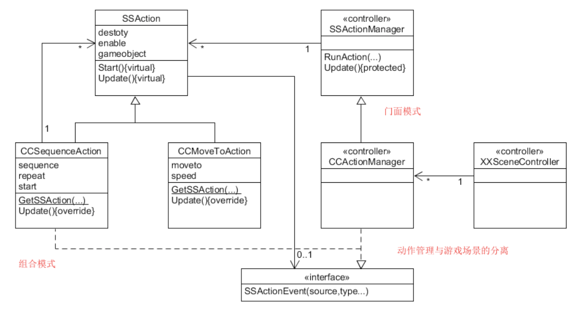

## 作业与练习

### 1 基本操作演练

#### Question 1.1

> 下载 Fantasy Skybox FREE， 构建自己的游戏场景

首先创建一个新项目，在 Asset Store 中搜索Fantasy Skybox FREE，下载后import到项目中。


得到的Assets内容如下：

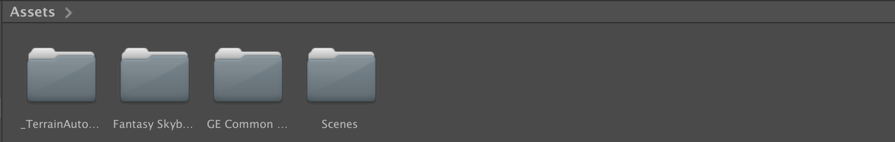

可以创建一个天空盒，步骤如下：

- Assets 上下文菜单 -> create -> Material 起名 mysky
- 在 Inspector 视图中选择 Shader -> Skybox -> 6Sided
- 在资源贴图中选择合适的图片，拖放到对应位置
- 在 Camera 对象中添加部件 Rendering -> Skybox
- 将天空盒拖放入 Skybox

再创建一个 Terrain，通过地形设计工具对该 Terrain 进行设计：

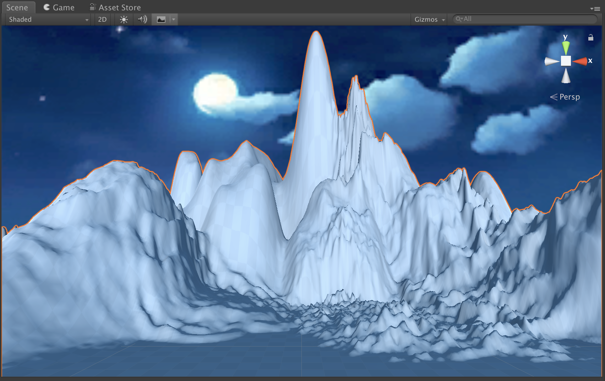

可以添加植被以及树木，并调整摄像机的位置，构建的游戏场景大致如下：

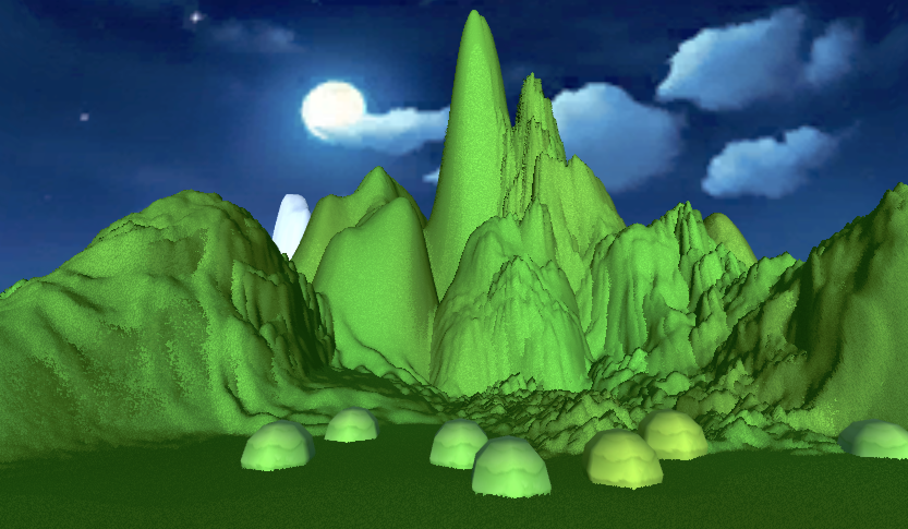

#### Question 1.2

> 写一个简单的总结，总结游戏对象的使用

- 在 unity3D 中，GameObject 元素有如下**种类**：
  - Empty
    - 常作为子对象的容器
    - 创建一个新的对象空间
  - 3D 物体
    - Cube、Sphere、Capsule、Sylinder、Plane、Quad
    - 构造 3D 物体：mesh、terrain 等
  - Camera、Light、Audio、UI、Particle System等

- 在实际的游戏设计中，我们还会依赖于**模型、预制**等。
  - 把基本的游戏对象组合起来，制作成 预制，以后把预制当作一个游戏对象使用

- 游戏物体一般有如下共有属性：Active、Name、Tag、Layer、transForm等。
- 游戏对象的外观和内在逻辑设计可以通过添加组件来实现。
- 游戏对象的行为可以通过添加脚本来完成。
- 游戏对象的实例化可以在图形界面中完成，也可以在编辑代码时完成。

### 2 编程实践

#### 2.1 技术要求

牧师与魔鬼-动作分离版：设计一个裁判类，当游戏达到结束条件时，通知场景控制器游戏结束

#### 2.2 游戏说明

**游戏规则与设定**

- 帮助三个牧师和三个魔鬼渡河。
- 船上最多可以载两名游戏角色。
- 船上需要有游戏对象才可移动。
- 当有一侧岸的魔鬼数多余牧师数时，魔鬼就会失去控制，吃掉牧师。
- 一侧岸的魔鬼数和牧师数数量统计包括岸上的以及靠岸船上的。
- 若有牧师被吃掉，则游戏失败。
- 所有游戏角色都到达对岸，则游戏胜利。

**游戏对象**

船（褐色长方体），牧师（白色方块），魔鬼（黑色圆球）、岸、河

**玩家动作表**

| 玩家动作 | 发生条件                           |
| :------: | ---------------------------------- |
|   上船   | 船上有空位时，点击上船对象可以上船 |
|   下船   | 船上有对象时，点击下船对象可以下船 |
|   开船   | 船在一岸时点击船可以开船到另一岸   |
| 重新开始 | 点击 Restart 按钮可重新开始        |

#### 2.3 完成情况

游戏界面如下：

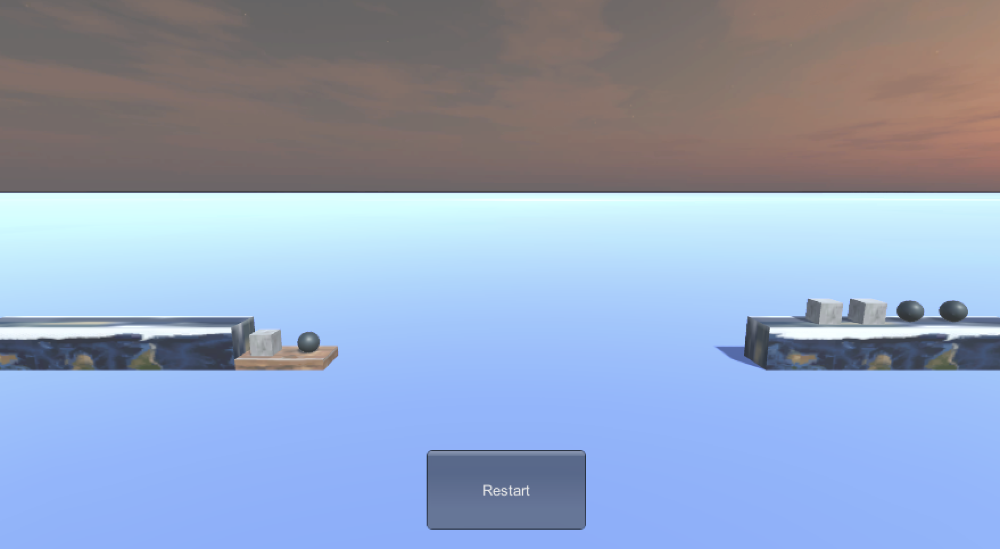


#### 2.4 项目设计

首先，增加天空盒的设计、修改对象预制、改变摄像机的位置，优化游戏效果。

然后是在基础MVC架构的原版本上，改为动作分离的版本。FirstController.cs、CoastSceneController.cs、BoatSceneController.cs、GameObjects.cs、InteracteGUI.cs的代码均有改动，详细可参见项目地址。而SSAction.cs中给出了动作基类、简单动作实现、顺序动作组合类实现、动作管理基类的代码。

此外，上一个版本中Moveable类的功能将完全由另一种形式实现，主要体现在Action.cs中，同时需要注意该脚本需添加到 Empty 物体上，代码如下：

```C#
using System;
using System.Collections;
using System.Collections.Generic;
using UnityEngine;
using Interfaces;

public class Action : SSActionManager, SSActionCallback
{
    public SSActionEventType comp = SSActionEventType.Completed;
    //  船的运动
    public void BoatMove(BoatSceneController boat)
    {
        // Debug.Log(boat.GetState());
        comp = SSActionEventType.Started;
        CCMoveToAction action = CCMoveToAction.getAction(boat.GetDestination(), boat.GetSpeed());
        addAction(boat.GetGameobject(), action, this);
        boat.ChangeState();
    }
    //  牧师和魔鬼的运动
    public void GameObjectsMove(GameObjects Object, Vector3 dest)
    {
        comp = SSActionEventType.Started;
        Vector3 pos1 = Object.getPosition();
        Vector3 pos2 = Object.getPosition();
        if (dest.y <= pos2.y)
        {
            pos2.x = dest.x;
        }
        else
        {
            pos2.y = dest.y;
        }
        SSAction action1 = CCMoveToAction.getAction(pos2, Object.getSpeed());
        SSAction action2 = CCMoveToAction.getAction(dest, Object.getSpeed());
        SSAction seq = CCSequenceAction.getAction(1, 0, new List<SSAction> { action1, action2 });
        this.addAction(Object.GetGameobject(), seq, this);
    }
    //  SSActionCallback
    public void SSActionCallback(SSAction source)
    {
        comp = SSActionEventType.Completed;
    }
}
```

最后是进行裁判类的设计修改，当游戏达到结束条件时，将由裁判类通知场景控制器游戏结束。裁判类设计为 Judge 类，实现对游戏内各物体状态的读取，得到两岸和船上各自的牧师数与魔鬼数，计算得出游戏状态，并通知场景进行改变，其代码如下：

```C#
using System.Collections;
using System.Collections.Generic;
using UnityEngine;
using Interfaces;

public class Judge : MonoBehaviour
{
    public int state;
    InteracteGUI UserGUI;
    private FirstController FC;

    void Awake()
    {
        state = 0; 
        UserGUI = gameObject.AddComponent<InteracteGUI>() as InteracteGUI;
        FC = GetComponent<FirstController>();
    }

    void Update()
    {
        Check();
        Debug.Log("state: " + state);
        UserGUI.SetState = state;
    }

    public void setState(int sta)
    {
        state = sta;
    }

    public int getState()
    {
        return state;
    }

    public void Check()
    {
        // 0-play, 1-win, 2-lose
        int p_coast1_num = 0;
        int d_coast1_num = 0;
        int p_coast2_num = 0;
        int d_coast2_num = 0;
        int[] coast1_arr = FC.coast1.GetobjectsNumber();
        int[] coast2_arr = FC.coast2.GetobjectsNumber();
        int[] boat_arr = FC.boat.GetobjectsNumber();
        //  分别计算两侧岸上的人数
        d_coast1_num += coast1_arr[0];
        p_coast1_num += coast1_arr[1];
        d_coast2_num += coast2_arr[0];
        p_coast2_num += coast2_arr[1];
        //  判断是否胜利
        if (p_coast2_num + d_coast2_num == 6)      // win
        {
            state = 1;
            return;
        }
        //  计算船上人数，累加进累加器
        if (FC.boat.GetState() == 1)
        {
            d_coast1_num += boat_arr[0];
            p_coast1_num += boat_arr[1];
        }
        else
        {
            d_coast2_num += boat_arr[0];
            p_coast2_num += boat_arr[1];
        }
        //  判断是否失败
        //  检查coast1
        if (p_coast1_num < d_coast1_num && p_coast1_num > 0)
        {
            state = 2;
            return;
        }
        //  检查coast2
        if (p_coast2_num < d_coast2_num && p_coast2_num > 0)
        {
            state = 2;
            return;
        }
        state = 0;
    }
}
```

### 3 材料与渲染联系

#### Question 3.1

>从 Unity 5 开始，使用新的 Standard Shader 作为自然场景的渲染。
>
>- 阅读官方 [Standard Shader](https://docs.unity3d.com/Manual/shader-StandardShader.html) 手册 。
>- 选择合适内容，如 [Albedo Color and Transparency](https://docs.unity3d.com/Manual/StandardShaderMaterialParameterAlbedoColor.html)，寻找合适素材，用博客展示相关效果的呈现

选择上次作业创建的星体 Earth 为素材，摄像机视角如下：

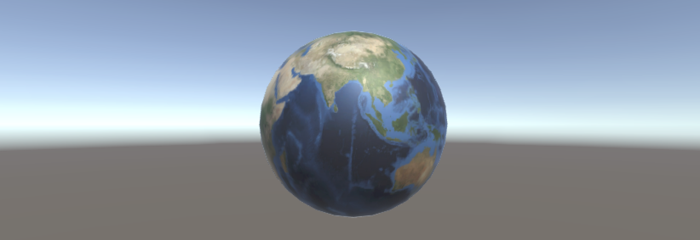

根据 Standard Shader 的参数意义，进行下列调试：

- Albedo：调整物体表面的基本颜色，在物理模型中相当于物体表面某处各子表面的散射颜色，把星体调整为偏红色之后效果如下：

  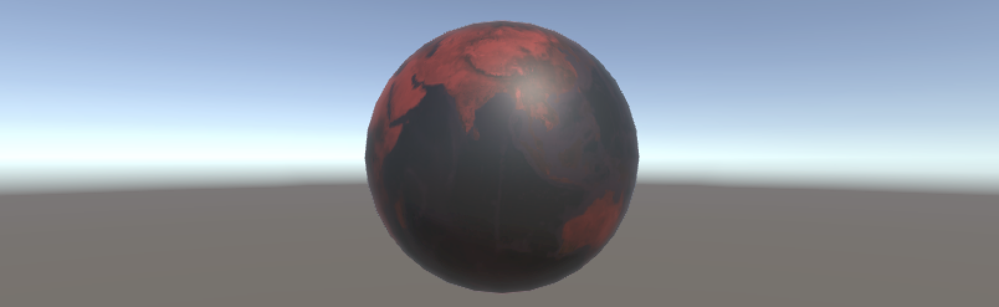

- Metallic：即金属感，表示物体表面和视线一致的面的对光线反射的能量。

- Smoonthness：可以体现物体表面的光滑程度，比例越大物体越光滑，反之越毛糙，金属的 smoothness 一般都很高。Metallic 和 Smoonthness 调整效果如下：

  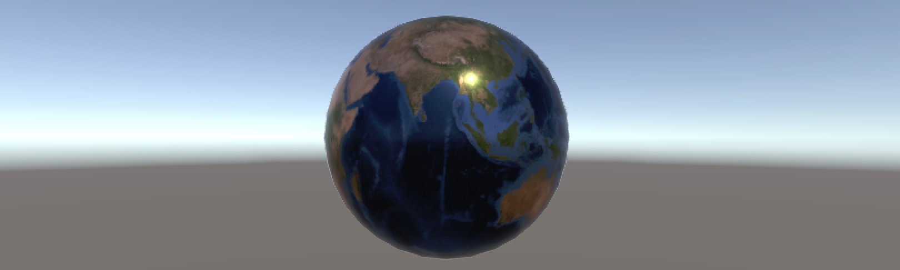

- Emission：自发光。

  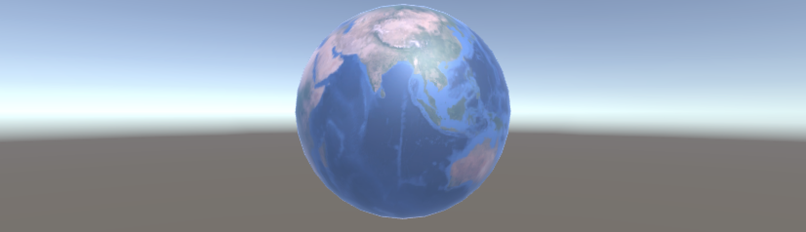

- Normal map：法线贴图。

- Height map：视差贴图，表现高低信息。

- Occlution：遮挡占据贴图。

  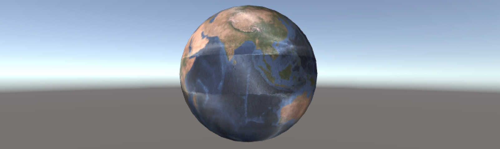

- secondary maps：第二道贴图。

- Detail Mask：对第二道贴图的mask。

#### Question 3.2

>Unity 5 声音
>
>- 阅读官方 [Audio](https://docs.unity3d.com/Manual/Audio.html) 手册
>- 用博客给出游戏中利用 Reverb Zones 呈现车辆穿过隧道的声效的案例

- 首先添加 GameObject，即 Audio Reverb Zone 和 Audio Source：

  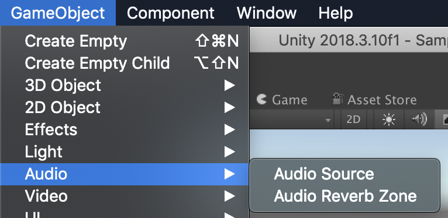

- 然后将 Audio Reverb Zone 的 Reverb Peset 设置为 Cave：

  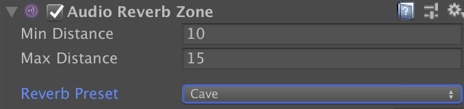

- 最后，在 Audio Source 加入车辆穿过隧道的声效，即可模拟出目标音效。

## 参考资料

[1] [游戏对象与图形基础_教学讲义](https://pmlpml.github.io/unity3d-learning/04-gameobject-and-graphics)

[2] [Maunal](https://docs.unity3d.com/Manual/index.html)

[3] [c# 结构体](http://www.cnblogs.com/kissdodog/archive/2013/05/11/3072832.html)

[4] [c# 枚举与常数](http://www.cnblogs.com/kissdodog/archive/2013/01/16/2863515.html)

[5] [官方 Standard Shader 手册](https://docs.unity3d.com/Manual/shader-StandardShader.html)