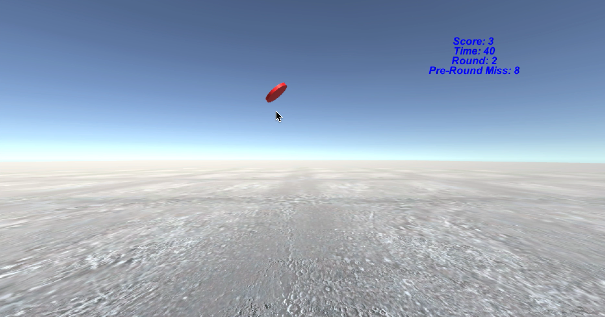
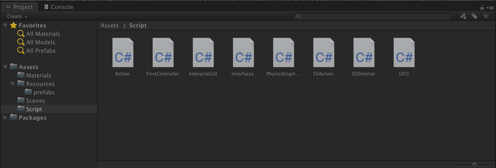

# 3D Game 6 - 物理系统与碰撞

> **It was awful tasting medicine, but I guess the patient needed it. Sometimes life hits you in the head with a brick. Don’t lose faith**
>
> *— Steve Jobs, Stanford Report, June 14, 2005*

## README

**博客地址**：https://sentimentalswordsman.github.io/2019/10/18/3dG6-物理系统与碰撞/

**HitUFO视频链接**：https://www.bilibili.com/video/av71623568/

## 物理系统与碰撞

### 物理引擎

**作用：** **物理引擎（Physics Engine）**是一个软件组件，它将游戏世界对象赋予现实世界物理属性（重量、形状等），并抽象为刚体（Rigid）模型（也包括滑轮、绳索等），使得游戏物体在力的作用下，仿真现实世界的运动及其之间的碰撞过程。即在牛顿经典力学模型基础之上，通过简单的 API 计算游戏物体的运动、旋转和碰撞，现实的运动与碰撞的效果。

**实现：** 随着技术的进步，作为典型密集计算场景，物理引擎逐步形成了两大流派，分别对应以 NVIDIA 为代表的 PhysX 和 以 Intel +AMD 为代表的 Havok 两大平台。

## 作业与练习

### 改进飞碟游戏

#### 技术要求

- 按 adapter模式 修改飞碟游戏
- 使它同时支持物理运动与运动学（变换）运动

#### 游戏说明

**游戏内容**

一个简单的鼠标打飞碟（Hit UFO）游戏

**游戏规则与设定**

1. 游戏有 4 个 round，每个 round 都包括10 次 trial；
2. 每个 trial 的飞碟的色彩、大小、发射位置、速度、角度、同时出现的个数都可能不同。它们由该 round 的 ruler 控制；
3. 每个 trial 的飞碟有随机性，总体难度随 round 上升；
4. 鼠标点中得分，得分规则按色彩、大小、速度不同计算，规则可自由设定。

#### 完成情况

游戏界面如下：




#### 项目设计

首先创建需要的游戏元素，如飞碟的预制、Terrain等，关于代码编写，首先是继承上一次项目“HitUFO-动作分离版”的成果，实现部分的代码复用，项目的文件结构如下：



优化了上一次的一个逻辑漏洞，最初把 Hit 的调用放在了 InteracteGUI 的 OnGUI 中，实际上根据逻辑，应该保留在 FirstController 中，否则会出现一个 bug，当点击到一个 UFO 时可能会计算多次得分，就此做了改动，消除该 bug，如下：

```C#
// FirstController.cs: void Update ()
//  homework6 改进
if (state)
{
  if (Input.GetButtonDown("Fire1"))
  {
    Vector3 pos = Input.mousePosition;
    Hit(pos);
  }
}
```

新增了每个 round 后 miss 的 UFO 数目的统计，并可以在 GUI 上显示出来。

新增了PhysicsEngineAction.cs，和 Action.cs 差不多，刻画了UFO的动作，但实现了运动对象的实例化。

PhysicsEngineAction.cs：

```C#
public class PhysicsEngineAction : SSActionManager, SSActionCallback, PhysicsEngineManager
{
    //  EventType
    public SSActionEventType comp = SSActionEventType.Completed;
    //  UFO 计数器
    int MoveUfoCount = 0;
    //  UFO 的运动
    public void UfoMove(UFO ufo)
    {
        MoveUfoCount++;
        comp = SSActionEventType.Started;
        CCPhysicsEngine action = CCPhysicsEngine.getAction(ufo.speed);
        addAction(ufo.gameObject, action, this);
    }
    //  确保结束
    public bool IsAllFinished()
    {
        if (MoveUfoCount == 0)
            return true;
        else
            return false;
    }
    //  SSActionCallback
    public void SSActionCallback(SSAction source)
    {
        MoveUfoCount--;
        comp = SSActionEventType.Completed;
        source.gameObject.SetActive(false);
    }
}
```

其他部分继承了上次项目的代码，仅有稍微改动，具体如下：

SSDirector.cs：实现动作基类。

```C#
public class SSDirector : System.Object {
    //  singltion instance
    private static SSDirector _instance;

    public ISceneController currentScenceController { get; set; }
    public bool running { get; set; }
    //  get instance anytime anywhere!
    public static SSDirector getInstance()
    {
        if (_instance == null)
        {
            _instance = new SSDirector();
        }
        return _instance;
    }

    public int getFPS()
    {
        return Application.targetFrameRate;
    }

    public void setFPS(int fps)
    {
        Application.targetFrameRate = fps;
    }
}
```

SSAction.cs：实现SSAction、CCMoveToAction和SSActionManager类，增加了CCPhysicsEngine类。

```C#
using System.Collections;
using System.Collections.Generic;
using UnityEngine;
using Interfaces;

// SSAction\CCMoveToAction\SSActionManager
// ppt-04、05

public class SSAction : ScriptableObject {

    public bool enable = true;
    public bool destroy = false;

    public GameObject gameObject;
    public Transform transform;
    public SSActionCallback CallBack;

    //
    public virtual void Start()
    {
        throw new System.NotImplementedException();
    }

    //
    public virtual void Update()
    {
        throw new System.NotImplementedException();
    }
}

public class CCMoveToAction : SSAction
{
    public float speedX;
    public float speedY = 0;

    private CCMoveToAction() { }
    public static CCMoveToAction getAction(float speed)
    {
        CCMoveToAction action = CreateInstance<CCMoveToAction>();
        action.speedX = speed;
        return action;
    }

    public override void Update()
    {
        //  抛物线运动，参照hw3
        this.transform.position += new Vector3(speedX * Time.deltaTime, -speedY * Time.deltaTime + (float)-0.5 * 10 * Time.deltaTime * Time.deltaTime, 0);
        speedY += 10 * Time.deltaTime;
        //  落地则摧毁
        if (transform.position.y <= 1)
        {
            destroy = true;
            CallBack.SSActionCallback(this);
        }
    }

    public override void Start()
    {
    }
}

public class SSActionManager : MonoBehaviour
{
    private Dictionary<int, SSAction> actions = new Dictionary<int, SSAction>();
    private List<SSAction> waitingToAdd = new List<SSAction>();
    private List<int> watingToDelete = new List<int>();

    protected void Update()
    {
        foreach (SSAction ac in waitingToAdd)
        {
            actions[ac.GetInstanceID()] = ac;
        }
        waitingToAdd.Clear();

        foreach (KeyValuePair<int, SSAction> kv in actions)
        {
            SSAction ac = kv.Value;
            if (ac.destroy)
            {
                watingToDelete.Add(ac.GetInstanceID());
            }
            else if (ac.enable)
            {
                ac.Update();
            }
        }

        foreach (int key in watingToDelete)
        {
            SSAction ac = actions[key];
            actions.Remove(key);
            DestroyObject(ac);
        }
        watingToDelete.Clear();
    }

    public void addAction(GameObject gameObject, SSAction action, SSActionCallback ICallBack)
    {
        action.gameObject = gameObject;
        action.transform = gameObject.transform;
        action.CallBack = ICallBack;
        waitingToAdd.Add(action);
        action.Start();
    }
}

//  new class for homework6
public class CCPhysicsEngine : SSAction
{
    public float speedX;
    public override void Start ()
    {
        if (!this.gameObject.GetComponent<Rigidbody>())
        {
            this.gameObject.AddComponent<Rigidbody>();
        }
        //  init Physics Engine
        this.gameObject.GetComponent<Rigidbody>().AddForce(Vector3.up * 9.8f * 0.6f, ForceMode.Acceleration);
        this.gameObject.GetComponent<Rigidbody>().AddForce(new Vector3(speedX, 0, 0), ForceMode.VelocityChange);
    }

    public static CCPhysicsEngine getAction(float speedX)
    {
        //  use speedX
        CCPhysicsEngine action = CreateInstance<CCPhysicsEngine>();
        action.speedX = speedX;
        return action;
    }

    override public void Update ()
    {
        if (transform.position.y <= 3)
        {
            //  move Rigidbody
            Destroy(this.gameObject.GetComponent<Rigidbody>());
            destroy = true;
            CallBack.SSActionCallback(this);
        }
    }

    private CCPhysicsEngine()
    {
    }
}
```

Action.cs：刻画了UFO的动作，上个版本完全由它负责动作管理。

```C#
public class Action : SSActionManager, SSActionCallback
{
    //  EventType
    public SSActionEventType comp = SSActionEventType.Completed;
    //  UFO 计数器
    int MoveUfoCount = 0;
    //  UFO 的运动
    public void UfoMove(UFO ufo)
    {
        MoveUfoCount++;
        comp = SSActionEventType.Started;
        CCMoveToAction action = CCMoveToAction.getAction(ufo.speed);
        addAction(ufo.gameObject, action, this);
    }
    //  确保结束
    public bool IsAllFinished()
    {
        if (MoveUfoCount == 0)
            return true;
        else
            return false;
    }
    //  SSActionCallback
    public void SSActionCallback(SSAction source)
    {
        MoveUfoCount--;
        comp = SSActionEventType.Completed;
        source.gameObject.SetActive(false);
    }
}
```

FirstController.cs：场记，该脚本需添加到 Empty 物体上，实现了游戏的开始、进行、结束和点击事件。

```C#
public class FirstController : MonoBehaviour, ISceneController, UserAction
{
    int score = 0;
    int miss = 0;
    int ufoNum = 0;
    int hitNum =0;
    //  游戏有 4 个 round，每个 round 都包括 10 次 trial
    int round = 1;
    int trial = 0;
    //  计数器
    int updateCount = 0;
    bool state = false; //  1-playing

    public bool PhysicEngineFlag = false;
    public bool PhysicEngineState = false;

    private PhysicsEngineManager action;
    private UFOFactory factory;

    void Awake()
    {
        //  GetComponent 需在外添加组件
        action = GetComponent<PhysicsEngineManager>();
        SSDirector director = SSDirector.getInstance();
        director.setFPS(60);
        director.currentScenceController = this;
        factory = UFOFactory.factory;
        GenGameObjects();
    }

    public void LoadResources()
    {   
        PhysicEngineState = PhysicEngineFlag;
        if (PhysicEngineFlag)
        {
            action = this.gameObject.AddComponent<PhysicsEngineAction>() as PhysicsEngineManager;
        }
        else
        {
            action = this.gameObject.AddComponent<Action>() as PhysicsEngineManager;
        }
    }

    public void GenGameObjects()
    {

    }

    public int GetRound()
    {
        return round;
    }

    public int GetScore()
    {
        return score;
    }

    public int GetMiss()
    {
        return miss;
    }

    void Start ()
    {
  
    }

    void Update ()
    {
        if (state)
        {
            updateCount++;
            if (updateCount >= 150)
            {
                if(factory == null)
                {
                    return;
                }
                trial++;
                // Debug.Log(round);
                UFO ufoOfThisRound = factory.GetUFO(round);
                action.UfoMove(ufoOfThisRound);
                ufoNum++;
                //  每个 round 都包括 10 次 trial
                if (trial == 10)
                {
                    round++;
                    trial = 0;
                    miss = ufoNum - hitNum;
                }
                updateCount = 0;
            }
        }
        //  homework6 改进
        if (state)
        {
            if (Input.GetButtonDown("Fire1"))
            {
                Vector3 pos = Input.mousePosition;
                Hit(pos);
            }
        }
	}

    public void Hit(Vector3 pos)
    {
        Ray ray = Camera.main.ScreenPointToRay(pos);
        RaycastHit[] raycastHits;
        raycastHits = Physics.RaycastAll(ray);
        for (int i = 0; i < raycastHits.Length; i++)
        {
            RaycastHit hit = raycastHits[i];
            if (hit.collider.gameObject.GetComponent<UFO>() != null)
            {
                hitNum++;
                //  颜色不同，得分不同
                Color c = hit.collider.gameObject.GetComponent<Renderer>().material.color;
                // Debug.Log("score:"+score+"  color:"+c);
                // Debug.Log("hit:" + hit.collider.gameObject + " stacktrace: " + new System.Exception());
                if (c == Color.red)
                    score += 1;
                if (c == Color.yellow)
                    score += 2;
                if (c == Color.black)
                    score += 3;
                //  根据 round 可以加分
                // if (round > 2)
                //     score += 1;
                hit.collider.gameObject.transform.position = new Vector3(0, -100, 0);
            }
        }
    }

    public bool GameFinish()
    {
        if (round > 4 && action.IsAllFinished())
        {
            if (PhysicEngineState)
            {
                Destroy(this.gameObject.GetComponent<PhysicsEngineAction>());
            }
            else
            {
                Destroy(this.gameObject.GetComponent<Action>());
            }
            factory.GetInSide();
            return true;
        }
        return false;
    }

    public void Restart()
    {
        score = 0;
        round = 1;
        state = true;
    }
}
```

UFO.cs：采用了工厂模式来实现UFO的生产以及复用。

```C#
//  UFO 基本属性
public class UFO : MonoBehaviour
{
    public float speed 
    { 
        get;
        set; 
    }
    public Color color 
    {
        get { return gameObject.GetComponent<Renderer>().material.color; }
        set { gameObject.GetComponent<Renderer>().material.color = value; }
    }
    public Vector3 StartPoint
    {
        get { return gameObject.transform.position; } 
        set { gameObject.transform.position = value; } 
    }
    public Vector3 Direction
    {
        get { return Direction; }
        set { gameObject.transform.Rotate(value); }
    }
}

//  UFO 工厂模式
public class UFOFactory
{
    //  init
    public static UFOFactory factory = new UFOFactory();
    public GameObject ufotemp;
    //  outside of UFOFactory
    private Dictionary<int, UFO> outUFO = new Dictionary<int, UFO>();
    //  inside of  UFOFactory
    private List<UFO> inUFO = new List<UFO>();

    private UFOFactory()
    {
        ufotemp = Object.Instantiate(Resources.Load<GameObject>("Prefabs/UFO"));
        //  给 UFO 添加上组件
        ufotemp.AddComponent<UFO>();
        ufotemp.SetActive(false);
    }

    //  根据 round 值，拿到对应的 UFO
    public UFO GetUFO(int round)  
    {
        //  round: 1, 2, 3, 4
        int ufoType;    //  0~4, easy~hard
        float dire;
        GetInSide();
        GameObject objectTemp = null;
        UFO ufo;
        //  从 UFOFactory 中，拿出一个 UFO
        if (inUFO.Count > 0)
        {
            objectTemp = inUFO[0].gameObject;
            inUFO.Remove(inUFO[0]);
            objectTemp.SetActive(true);
            ufo = objectTemp.AddComponent<UFO>();
        }
        else
        {
            objectTemp = Object.Instantiate(ufotemp, Vector3.zero, Quaternion.identity);
            objectTemp.SetActive(true);
            ufo = objectTemp.AddComponent<UFO>();
        }
        //  round -> UFO Type
        if (round == 1)
        {
            ufoType = Random.Range(0, 2);   //  0,1
        }
        else if (round == 2)
        {
            ufoType = Random.Range(0, 3);   //  0,1,2
        }
        else if (round == 3)
        {
            ufoType = Random.Range(1, 4);   //  1,2,3
        }
        else
        {
            ufoType = Random.Range(2, 5);   //  2,3,4
        } 
        //  UFO Type -> UFO
        switch (ufoType)  
        {          
            case 0:  
                {  
                    ufo.color = Color.red;  
                    ufo.speed = Random.Range(20, 30);  
                    ufo.StartPoint = new Vector3(Random.Range(-120, -90), Random.Range(30, 90), Random.Range(50, 70));
                    break;  
                }  
            case 1:  
                {  
                    ufo.color = Color.yellow;  
                    ufo.speed = -Random.Range(20, 30);  
                    ufo.StartPoint = new Vector3(Random.Range(90, 120), Random.Range(40, 80), Random.Range(40, 60));
                    break;  
                }  
            case 2:  
                {  
                    ufo.color = Color.black;  
                    ufo.speed = Random.Range(25, 35);  
                    ufo.StartPoint = new Vector3(Random.Range(-120, -190), Random.Range(30, 90), Random.Range(50, 70));
                    break;  
                }
            case 3:
                {
                    ufo.color = Color.red;
                    ufo.speed = -Random.Range(30, 40); 
                    ufo.StartPoint = new Vector3(Random.Range(90, 120), Random.Range(40, 80), Random.Range(40, 60));
                    break;
                }
            default:
                {
                    ufo.color = Color.red;  
                    ufo.speed = Random.Range(30, 40);  
                    ufo.StartPoint = new Vector3(Random.Range(-120, -190), Random.Range(30, 90), Random.Range(50, 70));
                    break;
                }
        }
        dire = UnityEngine.Random.Range(-1f, 1f) < 0 ? -1 : 1;
        ufo.Direction = new Vector3(dire, 0, 10);
        outUFO.Add(ufo.GetInstanceID(), ufo);
        ufo.name = ufo.GetInstanceID().ToString();
        return ufo;  
    }

    //  放回 UFOFactory
    public void GetInSide()
    {
        foreach (UFO ufo in outUFO.Values)
        {
            if (!ufo.gameObject.activeSelf)
            {
                inUFO.Add(ufo);
                outUFO.Remove(ufo.GetInstanceID());
                return;
            }
        }
    }
}
```

Interfaces.cs：接口，对新的场记和新的控制器进行了链接。

```C#
namespace Interfaces
{
    // copy from ppt
    public enum SSActionEventType : int { Started, Completed }

    public interface ISceneController
    {
        void LoadResources();
    }

    public interface UserAction
    {
        void Hit(Vector3 pos);
        int GetScore();
        int GetRound();
        int GetMiss();
        bool GameFinish();
        void Restart();
    }
    
    public interface PhysicsEngineManager
    {
        void UfoMove(UFO ufo);
        bool IsAllFinished();
    }

    public interface SSActionCallback
    {
        void SSActionCallback(SSAction source);
    }
}
```

InteracteGUI.cs：实现GUI。

```C#
public class InteracteGUI : MonoBehaviour
{
    private int round = 1;
    private bool flag = false;
    private float slip;
    private float Now;
    UserAction user_act;
    ISceneController scene_ctrl;
    private GUIStyle Style = new GUIStyle ();

	void Start ()
    {
        //  style init
        Style.fontSize = 16;
        Style.fontStyle = FontStyle.BoldAndItalic;
        Style.normal.textColor = Color.blue;
        Style.alignment = TextAnchor.MiddleCenter;
        //  user_act scene_ctrl init
        user_act = SSDirector.getInstance().currentScenceController as UserAction;
        scene_ctrl = SSDirector.getInstance().currentScenceController as ISceneController;
        //  Time.time
        slip = Time.time;
    }

    private void OnGUI()
    {
        round = user_act.GetRound();
        if (!flag)
            slip = Time.time;
        GUI.Label(new Rect(680, 30, 100, 70), "Score: " + user_act.GetScore().ToString(), Style);
        GUI.Label(new Rect(680, 45, 100, 70), "Time: " + ((int)(Time.time - slip)).ToString(), Style);
        GUI.Label(new Rect(680, 60, 100, 70), "Round: " + round, Style);
        GUI.Label(new Rect(680, 75, 100, 70), "Pre-Round Miss: " + user_act.GetMiss(), Style);
        if (!flag)
        {
            if (GUI.Button(new Rect(380, 200, 140, 70), "Start"))
            {
                slip = Time.time;
                flag = true;
                user_act.Restart();
            }
        }
        if (flag)
        {
            if (round > 4)
            {
                round = 4;
                if (user_act.GameFinish())
                {
                    flag = false;
                }
            }
        }
    }
}
```

## 参考资料

[1] [物理系统与碰撞_教学讲义](https://pmlpml.github.io/unity3d-learning/06-physics-and-collision)

[2] [Maunal](https://docs.unity3d.com/Manual/index.html)