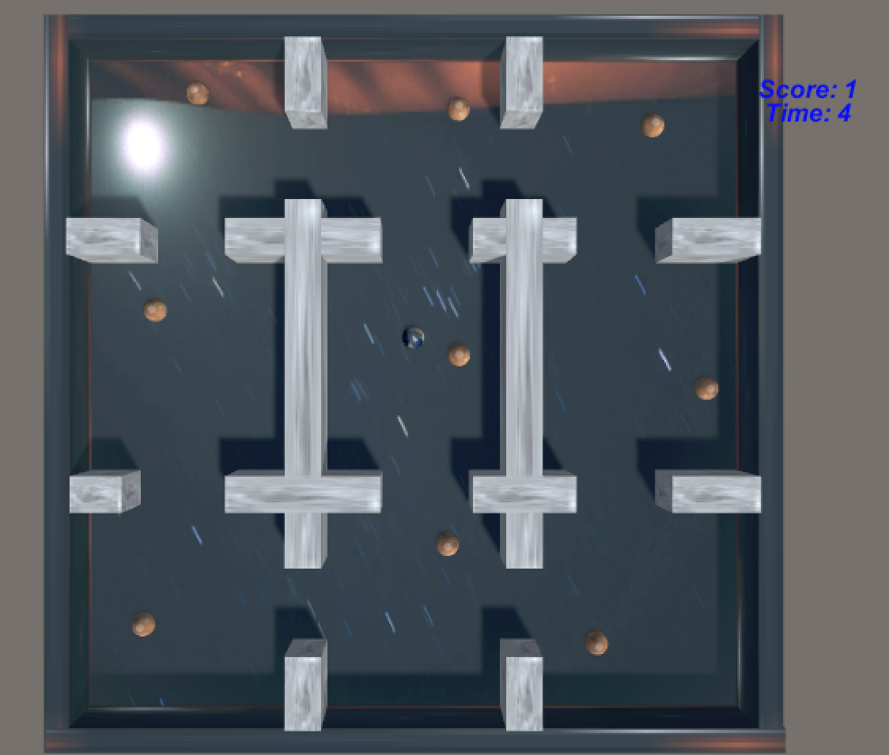
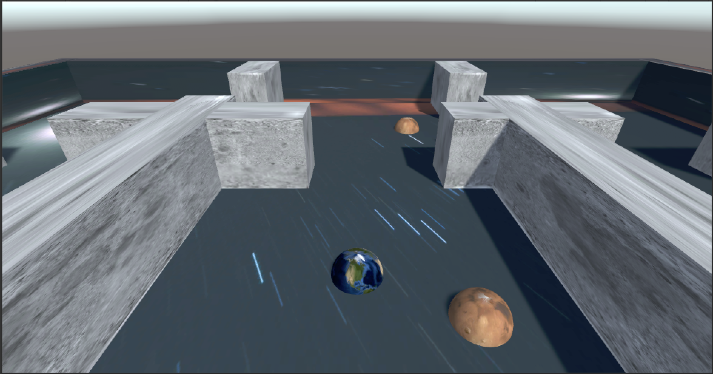
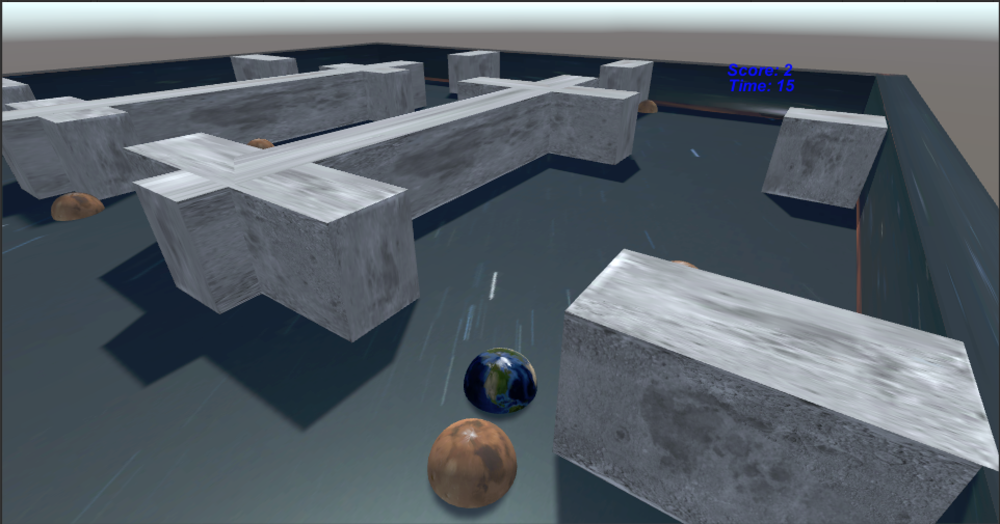
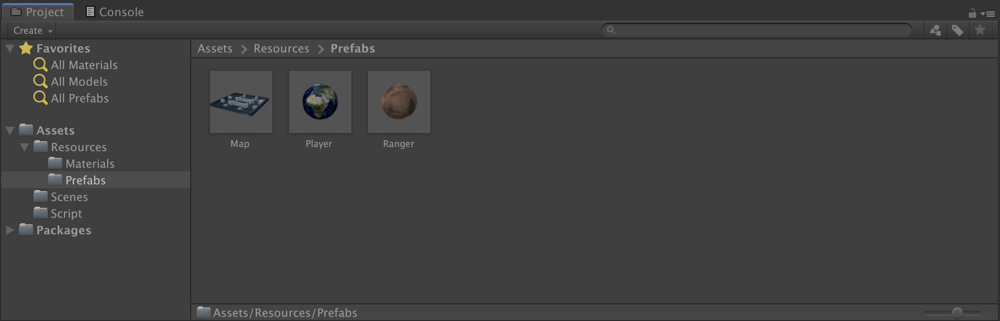
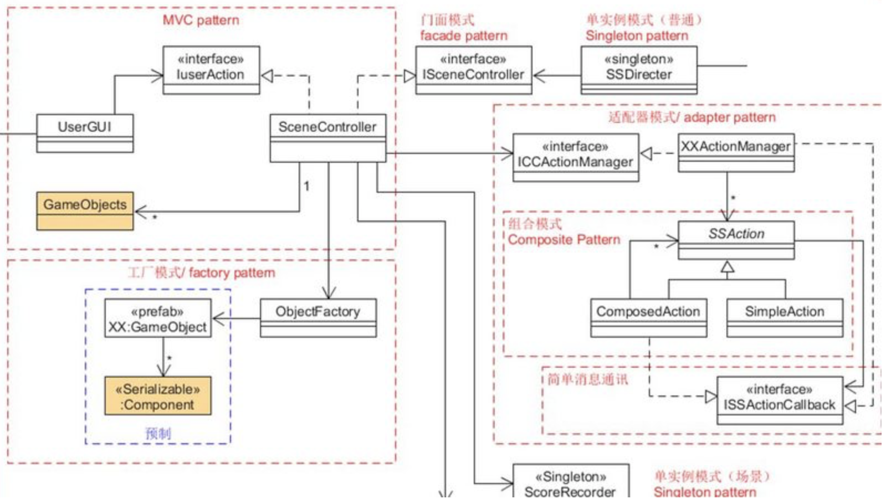
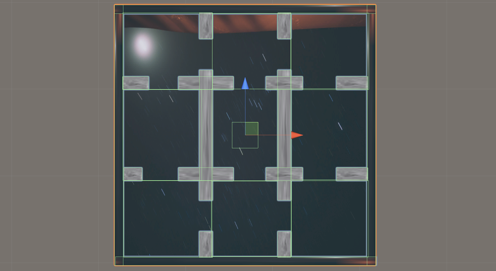

# 3D Game 7 - 模型与动画

> **云想衣裳花想容， 春风拂槛露华浓。
> 若非群玉山头见， 会向瑶台月下逢。**
>
> *— 【唐】李白 《清平调》*

## README

#### 项目地址

**博客地址：** https://sentimentalswordsman.github.io/2019/10/25/3dG7-模型与动画/

**Ranger 视频地址：** https://www.bilibili.com/video/av74312723/

## 模型与动画

人设之美令人难忘，它对游戏的成功至关重要。

## 作业与练习 - 智能巡逻兵

### 设计要求

- 创建一个地图和若干巡逻兵(使用动画)；
- 每个巡逻兵走一个3~5个边的凸多边型；
- 巡逻兵碰撞到障碍物，则会自动选下一个点为目标；
- 巡逻兵在设定范围内感知到玩家，会自动追击玩家；
- 失去玩家目标后，继续巡逻；
- 计分：玩家每次甩掉一个巡逻兵计一分，与巡逻兵碰撞游戏结束；

### 技术要求

- 必须使用订阅与发布模式传消息
- 工厂模式生产巡逻兵

- 参考：生成凸多边型，可以随机生成矩形，在矩形每个边上随机找点，可得到 3 - 4 的凸多边型

### 完成情况

**游戏界面1**



**游戏界面2**



**游戏界面3**



#### 项目设计

**目录结构**



**组织结构**

使用动作分离的模式、工厂模式、MVC架构等。此外，还新增了订阅与发布模式，用于传递消息。



**素材设计**

游戏中的地图由预制的素材导入，主体为一个plane，再填上四个cube的长形墙体，以及十余块cube的白色障碍物墙体。障碍物将地图划分为9个区域，每个区域都需设置is trigger属性，并添加VisionCollide文件，以检测玩家的通过。

游戏中的玩家和巡逻兵也由预制生成，外观均为球体，且都具有刚体属性。巡逻兵需添加PlayerCollide文件，以检测巡逻兵与玩家的碰撞行为。巡逻兵由工厂模式生成，一共9个，各区域均有一个巡逻兵负责巡逻。摄像机有两种可选的设置方案，其一是在顶部观察整个地图，其二是可以设置为玩家Player的子对象，以第一视角展现游戏界面。



**代码分析**

SSDirector.cs：实现动作基类。

```C#
public class SSDirector : System.Object {
    //  singltion instance
    private static SSDirector _instance;
    public ISceneController currentScenceController { get; set; }
    public bool running { get; set; }
    //  get instance anytime anywhere!
    public static SSDirector getInstance()
    {
        if (_instance == null)
        {
            _instance = new SSDirector();
        }
        return _instance;
    }

    public int getFPS()
    {
        return Application.targetFrameRate;
    }

    public void setFPS(int fps)
    {
        Application.targetFrameRate = fps;
    }
}
```

SSAction.cs：实现SSAction、CCMoveToAction和SSActionManager类，增加了CCTracertAction类。

```C#
// SSAction\CCMoveToAction\SSActionManager\CCTracertAction
// ppt-04、05
public class SSAction : ScriptableObject {

    public bool enable = true;
    public bool destroy = false;

    public GameObject gameObject;
    public Transform transform;
    public SSActionCallback CallBack;

    //
    public virtual void Start()
    {
        throw new System.NotImplementedException();
    }

    //
    public virtual void Update()
    {
        throw new System.NotImplementedException();
    }
}

public class CCMoveToAction : SSAction
{
    public Vector3 pos;
    public float speed;
    public int count;

    private CCMoveToAction() { }

    public static CCMoveToAction getAction(int count, float speed, Vector3 position)
    {
        CCMoveToAction action = ScriptableObject.CreateInstance<CCMoveToAction>();
        action.pos = position;
        action.speed = speed;
        action.count = count;
        return action;
    }

    public override void Start()
    {
        Quaternion rotation = Quaternion.LookRotation(pos - transform.position, Vector3.up);
        transform.rotation = rotation;
    }

    public override void Update()
    {
        //  移动
        if (this.transform.position == pos)
        {
            destroy = true;
            CallBack.SSActionCallback(this);
        }
        this.transform.position = Vector3.MoveTowards(transform.position, pos, speed * Time.deltaTime);
    }
}

public class SSActionManager : MonoBehaviour
{
    private Dictionary<int, SSAction> actionDict = new Dictionary<int, SSAction>();
    private List<SSAction> actionWating = new List<SSAction>();
    private List<int> actionFinishing = new List<int>();

    public void addAction(GameObject gameObject, SSAction action, SSActionCallback ICallBack)
    {
        action.gameObject = gameObject;
        action.transform = gameObject.transform;
        action.CallBack = ICallBack;
        actionWating.Add(action);
        action.Start();
    }

    protected void Update()
    {
        foreach (SSAction actionTemp in actionWating)
        {
            actionDict[actionTemp.GetInstanceID()] = actionTemp;
        }
        actionWating.Clear();
        foreach (KeyValuePair<int, SSAction> kv in actionDict)
        {
            SSAction actionTemp = kv.Value;
            if (actionTemp.destroy)
            {
                actionFinishing.Add(actionTemp.GetInstanceID());
            }
            else if (actionTemp.enable)
            {
                actionTemp.Update();
            }
        }
        foreach (int index in actionFinishing)
        {
            SSAction actionTemp = actionDict[index];
            actionDict.Remove(index);
            DestroyObject(actionTemp);
        }
        actionFinishing.Clear();
    }
}

public class CCTracertAction : SSAction
{
    public GameObject gameObejectTemp;
    public float speed;

    private CCTracertAction() { }
    public static CCTracertAction getAction(GameObject gameObejectTemp, float speed)
    {
        CCTracertAction action = ScriptableObject.CreateInstance<CCTracertAction>();
        action.gameObejectTemp = gameObejectTemp;
        action.speed = speed;
        return action;
    }

    public override void Start()
    {
    }

    public override void Update()
    {
        this.transform.position = Vector3.MoveTowards(transform.position, gameObejectTemp.transform.position, speed * Time.deltaTime);
        Quaternion rotation = Quaternion.LookRotation(gameObejectTemp.transform.position - gameObject.transform.position, Vector3.up);
        gameObject.transform.rotation = rotation;
        if (gameObject.GetComponent<Ranger>().isTracerting == false||transform.position == gameObejectTemp.transform.position)
        {
            destroy = true;
            CallBack.SSActionCallback(this);
        }
    }
}
```

Action.cs：主要刻画了Ranger的巡逻和追踪动作，负责动作管理。

```C#
public class Action : SSActionManager, SSActionCallback
{
    public SSActionEventType comp = SSActionEventType.Completed;
    Dictionary<int, CCMoveToAction> actionDict = new Dictionary<int, CCMoveToAction>();
    //  SSActionCallback
    public void SSActionCallback(SSAction source)
    {
        if(actionDict.ContainsKey(source.gameObject.GetComponent<Ranger>().posNum)) actionDict.Remove(source.gameObject.GetComponent<Ranger>().posNum);
        Patrol(source.gameObject);
    }
    //  追踪
    public void Tracert(GameObject rangerTemp, GameObject player)
    {
        if (actionDict.ContainsKey(rangerTemp.GetComponent<Ranger>().posNum)) actionDict[rangerTemp.GetComponent<Ranger>().posNum].destroy = true;
        CCTracertAction actionTemp = CCTracertAction.getAction(player, 0.8f);
        addAction(rangerTemp.gameObject, actionTemp, this);
    }
    //  巡逻
    public void Patrol(GameObject rangerTemp)
    {
        CCMoveToAction actionTemp = CCMoveToAction.getAction(rangerTemp.GetComponent<Ranger>().posNum, 1.5f, GetNewPos(rangerTemp));
        actionDict.Add(rangerTemp.GetComponent<Ranger>().posNum, actionTemp);
        addAction(rangerTemp.gameObject, actionTemp, this);
    }
    //  位置更新
    private Vector3 GetNewPos(GameObject rangerTemp)
    {
        Vector3 pos = rangerTemp.transform.position;
        Vector3 posAdd = pos;
        Vector3 posNew = pos;
        int posNum = rangerTemp.GetComponent<Ranger>().posNum;
        float x1 = -5f + (posNum % 3) * 9f;
        float x2 = -13f + (posNum % 3) * 10f;
        float z1 = 13f - (posNum / 3) * 9.5f;
        float z2 = 5f - (posNum / 3) * 9.5f;
        posAdd = new Vector3(Random.Range(-2f, 2f), 0, Random.Range(-2f, 2f));
        posNew = pos + posAdd;
        while (!(posNew.x<x1 && posNew.x>x2 && posNew.z<z1 && posNew.z > z2))
        {
            posAdd = new Vector3(Random.Range(-1f, 1f), 0, Random.Range(-1f, 1f));
            posNew = pos + posAdd;
        }
        return posNew;
    }
    //  结束
    public void AllFinished()
    {
        foreach(CCMoveToAction x in actionDict.Values)
        {
            x.destroy = true;
        }
        actionDict.Clear();
    }
}
```

FirstController.cs：场记，该脚本需添加到 Empty 物体上，实现了游戏的开始、进行、结束事件。

```C#
public class FirstController : MonoBehaviour, ISceneController, UserAction
{
    Dictionary<int, GameObject> ranger_dict = null;
    RangerFactory ranger_factory;
    GameObject player = null;
    Action action = null;
    int score = 0;
    int player_vision = 4;
    bool game_state = false;

    //  awake
    void Awake()
    {
        SSDirector director = SSDirector.getInstance();
        director.currentScenceController = this;
        ranger_factory = RangerFactory.ranger_factory;
        if(action == null) 
        {
            action = gameObject.AddComponent<Action>();
        }
        if (player == null && ranger_dict == null)
        {
            Instantiate(Resources.Load<GameObject>("Prefabs/Map"), new Vector3(0, 0, 0), Quaternion.identity);
            player = Instantiate(Resources.Load("Prefabs/Player"), new Vector3(0, 0, 0), Quaternion.identity) as GameObject;
            ranger_dict = ranger_factory.GetRanger();
        }
        if (player.GetComponent<Rigidbody>())
        {
            player.GetComponent<Rigidbody>().freezeRotation = true;
        }
        LoadResources();
    }

    //  load
    public void LoadResources()
    {
        //
    }

    //  update
    void Update ()
    {
        if (player.transform.localEulerAngles.x != 0 || player.transform.localEulerAngles.z != 0)
        {
            player.transform.localEulerAngles = new Vector3(0, player.transform.localEulerAngles.y, 0);
        }
        if (player.transform.position.y <= 0)
        {
            player.transform.position = new Vector3(player.transform.position.x, 0, player.transform.position.z);
        }
    }

    public int GetScore()
    {
        return score;
    }

    public bool GetGameState()
    {
        return game_state;
    }

    void OnEnable()
    {
        EventManager.score_temp += AddScore;
        EventManager.gameover_temp += GameOver;
    }

    void OnDisable()
    {
        EventManager.score_temp -= AddScore;
        EventManager.gameover_temp -= GameOver;
    }

    void AddScore()
    {
        if (game_state)
        {
            ++score;
            ranger_dict[player_vision].GetComponent<Ranger>().isTracerting = true;
            action.Tracert(ranger_dict[player_vision], player);
        }
    }

    void GameOver()
    {
        action.AllFinished();
        ranger_dict[player_vision].GetComponent<Ranger>().isTracerting = false;
        game_state = false;
    }

    public void PlayerMove(float move_x, float move_z)
    {
        if (game_state && player != null)
        {
            player.transform.Translate(0, 0, move_z * 4f * Time.deltaTime);
            player.transform.Rotate(0, move_x * 50f * Time.deltaTime, 0);
        }
    }

    public void SetPlayerArea(int x)
    {
        // Debug.Log(player_vision);
        // Debug.Log(x);
        // Debug.Log(game_state);
        // Debug.Log("-------");
        if (player_vision != x && game_state)
        {
            ranger_dict[player_vision].GetComponent<Ranger>().isTracerting = false;
            player_vision = x;
        }
    }

    public void Restart()
    {
        ranger_factory.PatrolFinished();
        score = 0;
        game_state = true;
        player.transform.position = new Vector3(0, 0, 0);
        ranger_dict[player_vision].GetComponent<Ranger>().isTracerting = true;
        action.Tracert(ranger_dict[player_vision], player);
        foreach (GameObject x in ranger_dict.Values)
        {
            if (!x.GetComponent<Ranger>().isTracerting)
            {
                action.Patrol(x);
            }
        }
    }
}
```

Ranger.cs：采用了工厂模式来实现Ranger的生产。

```C#
//  巡逻兵 基本属性
public class Ranger : MonoBehaviour
{
    //  巡逻兵所在的区块计数
    public int posNum;
    //  巡逻兵1-追踪/0-巡逻标志
    public bool isTracerting = false;
    //  刚体性质
    private void Start()
    {
        if (gameObject.GetComponent<Rigidbody>())
        {
            gameObject.GetComponent<Rigidbody>().freezeRotation = true;
        }
    }
    //  处理碰撞
    void Update()
    {
        if (this.gameObject.transform.localEulerAngles.x != 0 || gameObject.transform.localEulerAngles.z != 0)
        {
            gameObject.transform.localEulerAngles = new Vector3(0, gameObject.transform.localEulerAngles.y, 0);
        }
        if (gameObject.transform.position.y != 0)
        {
            gameObject.transform.position = new Vector3(gameObject.transform.position.x, 0, gameObject.transform.position.z);
        }
    }
}

//  巡逻兵 工厂模式
public class RangerFactory
{
    //  init
    public static RangerFactory ranger_factory = new RangerFactory();
    //  地图上的巡逻兵列表
    private Dictionary<int, GameObject> ranger_working = new Dictionary<int, GameObject>();
    //  九宫格地图上，巡逻兵的位置坐标
    int[] positionX = { -10, 2, 10 };
    int[] positionZ = { 10, 1, -10 };
    //  实质上在GetRanger()中完成
    private RangerFactory()
    {
    }
    //  创建巡逻兵
    public Dictionary<int, GameObject> GetRanger()
    {
        for(int i = 0; i < 3; i++)
        {
            for(int j = 0; j < 3; j++)
            {
                GameObject ranger_temp = Object.Instantiate(Resources.Load<GameObject>("Prefabs/Ranger"));
                //  给巡逻兵添加组件
                ranger_temp.AddComponent<Ranger>();
                //  决定巡逻兵的位置
                ranger_temp.transform.position = new Vector3(positionX[j], 0, positionZ[i]);
                ranger_temp.GetComponent<Ranger>().posNum = i * 3 + j;
                ranger_temp.SetActive(true);
                ranger_working.Add(i * 3 + j, ranger_temp);
            }
        }
        return ranger_working;
    }
    //  结束巡逻工作
    public void PatrolFinished()
    {
        for (int i = 0; i < 3; i++)
        {
            for(int j = 0; j < 3; j++)
            {
                ranger_working[i * 3 + j].transform.position = new Vector3(positionX[j], 0, positionZ[i]);
            }
        }
    }
}
```

EventManager.cs：游戏事件的管理，包括加分和游戏结束。

```C#
public class EventManager
{
    //  init
    public static EventManager Instance = new EventManager();
    private EventManager() { }
    //  委托：计分
    public delegate void ScoreEvent();
    public static event ScoreEvent score_temp;
    //  委托：Game Over
    public delegate void GameoverEvent();
    public static event GameoverEvent gameover_temp;
    //  脱离追踪 -> 计分
    public void RangerAddScore()
    {
        if (score_temp != null)
        {
            score_temp();
        }
    }
    //  物理碰撞 -> Game Over
    public void RangerGameover()
    {
        if (gameover_temp != null)
        {
            gameover_temp();
        }
    }
}
```

PlayerCollide.cs：负责管理玩家和巡逻兵的碰撞。

```C#
//  处理玩家和巡逻兵的物理碰撞 -> 游戏结束
public class PlayerCollide : MonoBehaviour
{
    void OnCollisionEnter(Collision collision)
    {
        if (collision.gameObject.tag == "Player")
        {
            // Debug.Log("EventManager.Instance.RangerGameover()");
            EventManager.Instance.RangerGameover();
        }
    }
}
```

VisionCollide.cs：负责管理玩家闯过某个区域的事件，即加分、进入下一个巡逻兵的视野范围。

```C#
//  处理玩家和巡逻兵的视野碰撞 -> 追踪
public class VisionCollide : MonoBehaviour
{
    public int sign = 0;
    FirstController first_controller;

    private void Start()
    {
        first_controller = SSDirector.getInstance().currentScenceController as FirstController;
    }

    void OnTriggerEnter(Collider collider)
    {
        // Debug.Log("sign: " + sign);
        if (collider.gameObject.tag == "Player")
        {
            // Debug.Log("!!! sign: " + sign);
            first_controller.SetPlayerArea(sign);
            EventManager.Instance.RangerAddScore();
        }
    }
}
```

Interfaces.cs：接口，对新的场记和新的控制器进行了链接。

```C#
using UnityEngine;
using System.Collections;
using System.Collections.Generic;

namespace Interfaces
{
    // copy from ppt
    public enum SSActionEventType : int { Started, Completed }

    public interface ISceneController
    {
        void LoadResources();
    }

    public interface UserAction
    {
        void Restart();
        int GetScore();
        bool GetGameState();
        void PlayerMove(float move_x, float move_z);
    }
    
    public interface SSActionCallback
    {
        void SSActionCallback(SSAction source);
    }
}
```

InteracteGUI.cs：实现GUI，需添加到摄像机上。

```C#
public class InteracteGUI : MonoBehaviour
{
    UserAction user_act;
    ISceneController scene_ctrl;
    private GUIStyle Style = new GUIStyle ();
    private bool flag = false;
    private float slip;

	void Start ()
    {
        //  style init
        Style.fontSize = 16;
        Style.fontStyle = FontStyle.BoldAndItalic;
        Style.normal.textColor = Color.blue;
        Style.alignment = TextAnchor.MiddleCenter;
        //  user_act scene_ctrl init
        user_act = SSDirector.getInstance().currentScenceController as UserAction;
        scene_ctrl = SSDirector.getInstance().currentScenceController as ISceneController;
        //  Time.time
        slip = Time.time;
    }

    //  获取方向键信息
    private void Update()
    {
        float move_x = Input.GetAxis("Horizontal");
        float move_z = Input.GetAxis("Vertical");
        user_act.PlayerMove(move_x, move_z);
    }

    private void OnGUI()
    {
        if (!flag)
        {
            slip = Time.time;
        }
        GUI.Label(new Rect(680, 30, 100, 70), "Score: " + user_act.GetScore().ToString(), Style);
        GUI.Label(new Rect(680, 45, 100, 70), "Time: " + ((int)(Time.time - slip)).ToString(), Style);
        if (!flag)
        {
            if (GUI.Button(new Rect(380, 200, 140, 70), "Start"))
            {
                flag = true;
                scene_ctrl.LoadResources();
                slip = Time.time;
                user_act.Restart();
            }
        }
        else
        {
            if (!user_act.GetGameState())
            {
                flag = false;
            }
        }
    }
}
```

## 参考资料

[1] [模型与动画_教学讲义](https://pmlpml.github.io/unity3d-learning/07-model-and-animation)

[2] [Maunal](https://docs.unity3d.com/Manual/index.html)