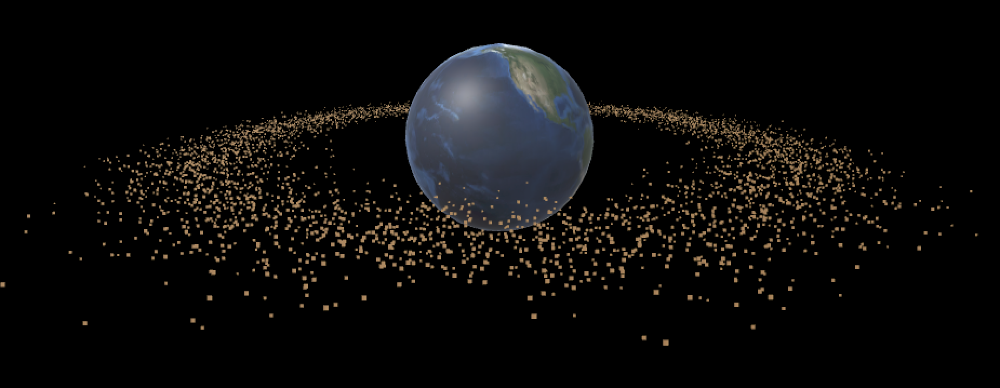
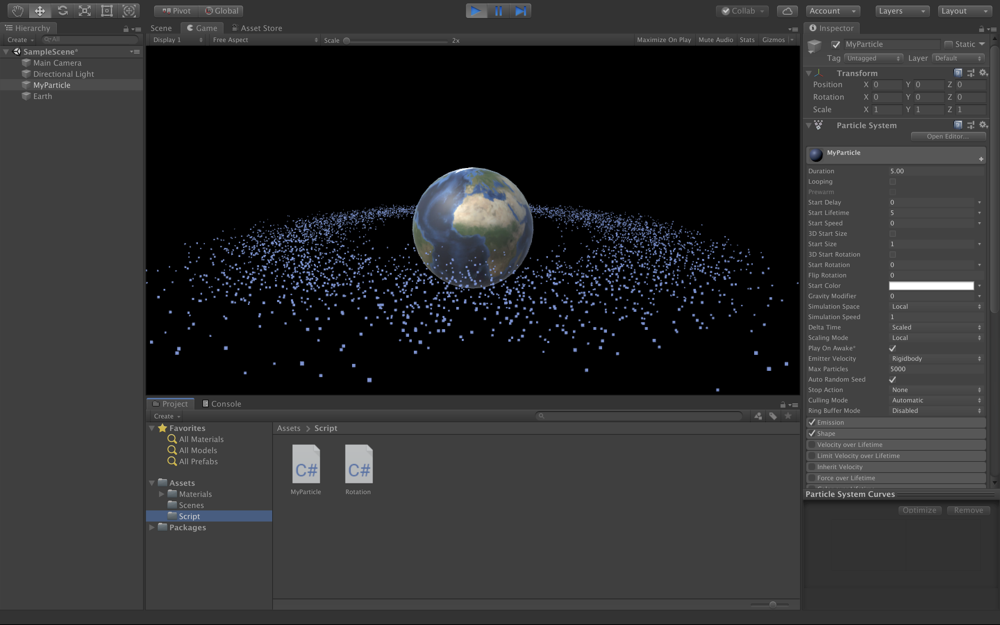
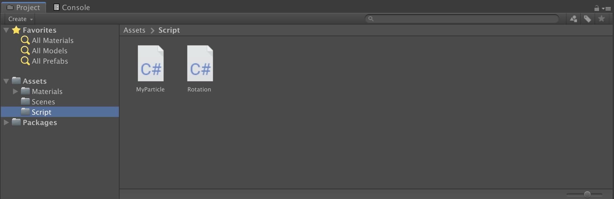
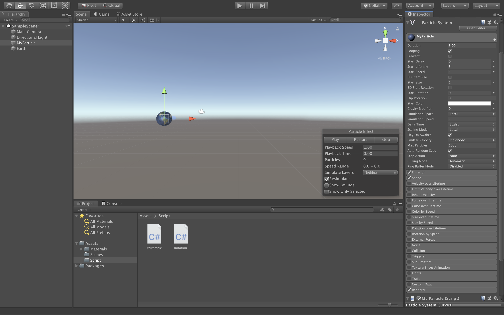

# 3D Game 8 - 粒子系统

> **东风袅袅泛崇光，香雾空蒙月转廊。**
> 
>*— 【宋】苏轼 《海棠》*

## README

**博客地址：** https://sentimentalswordsman.github.io/2019/11/04/3dG8-粒子系统/

**ParticleSystem 视频地址：** https://www.bilibili.com/video/av74559806/

## 粒子系统概述

**粒子系统**：是模拟一些不确定、流动现象的技术。它采用许多形状简单且赋予生命的微小粒子作为基本元素来表示物体，表达物体的总体形态和特征的动态变化。人们经常使用粒子系统模拟的现象有火、爆炸、烟、水流、火花、落叶、云、雾、雪、尘、流星尾迹或者象发光轨迹这样的抽象视觉效果等等。作为粒子系统，每个粒子运动一般具有简单的数学模型和它们之间具有自形似的运动过程。通过引入特定的随机分布作用于粒子，使得系统整体呈现复杂的现象，这是粒子系统的本质。

**粒子**：是粒子系统管理的基本单位。一般它是材料（Material）。材料包含两个内容，纹理（texture）、shader，分别负责形态、光照效果、两个方面。通常，粒子系统包含基础材料库供用户选择。

**渲染**：是定义粒子材料与摄像机之间的关系。主要包括材料面方位、显示顺序、光照等信息。

**运动管理**：即粒子运动学或物理学管理。包括颜色、力场、速度、碰撞等属性。

**发射器管理**：即粒子工厂的管理。包括粒子初始化、喷射位置与形状等等。

## 作业与练习：简单粒子制作

### 作业要求

参考相关网站，使用粒子流编程控制制作一些效果， 如“粒子光环”。

### 预期目标

完成一个行星和围绕其的行星光环界面，行星光环由粒子系统实现。

### 完成情况

**游戏界面1**



**游戏界面2**



### 项目设计

**目录结构**



**完成步骤**

首先修正背景为星空，更改摄像机上的天空盒属性即可。然后添加一个球体并贴图，作为中心行星，同时添加自转脚本，代码如下所示：

```c#
using System.Collections;
using System.Collections.Generic;
using UnityEngine;
//  copy from homework2
//  完成行星的自转过程
public class Rotation : MonoBehaviour
{
	// Use this for initialization
	void Start ()
  {
	}
	// Update is called once per frame
	void Update ()
  {
        //  自转速度随机
        this.transform.RotateAround(this.transform.position, Vector3.up, Random.Range(1, 2));
	}
}
```

再创建一个空物体，添加上unity自带的ParticleSystem组件，即赋予粒子系统的属性，可以直接给空物体贴图。



给粒子系统添加C#脚本，以控制粒子的各项参数，代码及注释如下：

```C#
using System.Collections;
using System.Collections.Generic;
using UnityEngine;
//  用于存储粒子的半径及偏角信息
public class ParticleData
{
    public float radius = 0;
    public float angle = 0;
    public ParticleData(float r, float a)
    {
        this.radius = r;
        this.angle = a;
    }
}
//  MyParticle - 粒子系统的设置
public class MyParticle : MonoBehaviour
{
    //  粒子系统 与 粒子数组
    public int particle_num = 10000;
    private ParticleSystem particle_system; 
    private ParticleData[] particle_data_array;
    private ParticleSystem.Particle[] particle_array;
    //  init
    void Start ()
    {
        float min_radius = 2.0f;
        float max_radius = 3.5f;
        particle_system = this.GetComponent<ParticleSystem>();
        particle_data_array = new ParticleData[particle_num];
        particle_array = new ParticleSystem.Particle[particle_num];
        particle_system.startSpeed = 0;   
        //  设置最大粒子数 
        particle_system.maxParticles = particle_num;
        //  设置为无循环
        particle_system.loop = false;
        //  粒子发射
        particle_system.Emit(particle_num);
        particle_system.GetParticles(particle_array);
        //  粒子初始化
        for (int i = 0; i < particle_num; i++)
        {
            //  得到每个粒子的大小、运动半径和偏角
            //  半径应使得粒子概率分布于周围，且集中于平均半径附近
            float size = Random.Range(0.01f, 0.02f);
            float min_radius_rate = Random.Range(1.0f, (max_radius + min_radius) / 2 / min_radius);
            float max_radius_rate = Random.Range((max_radius + min_radius) / 2 / max_radius, 1.0f);
            float radius = Random.Range(min_radius * min_radius_rate, max_radius * max_radius_rate);
            float angle = Random.Range(0, 2 * Mathf.PI);
            //  对应到粒子数组
            particle_data_array[i] = new ParticleData(radius, angle);            
            particle_array[i].size = size;  
            particle_array[i].position = new Vector3(particle_data_array[i].radius * Mathf.Cos(angle), 0f, particle_data_array[i].radius * Mathf.Sin(angle));
        }
        //  对应到粒子系统
        particle_system.SetParticles(particle_array, particle_array.Length);
    }
    //  update
    void Update()
    {
        for (int i = 0; i < particle_num; i++)
        {
            //  使粒子的半径时刻发生微小变化
            float offset = Random.Range(-0.01f, 0.01f);
            particle_data_array[i].radius += offset;
            //  使粒子的旋转速度时刻发生变化
            float angle = Random.Range(0, 2 * Mathf.PI);
            //  对应到粒子数组
            particle_array[i].position = new Vector3(particle_data_array[i].radius * Mathf.Cos(angle), 0f, particle_data_array[i].radius * Mathf.Sin(angle));
        }
        //  对应到粒子系统
        particle_system.SetParticles(particle_array, particle_array.Length);
    }
}
```

## 参考资料

[1] [粒子系统_教学讲义](https://pmlpml.github.io/unity3d-learning/08-particle-system)

[2] [Maunal](https://docs.unity3d.com/Manual/index.html)

[3]  http://i-remember.fr/en