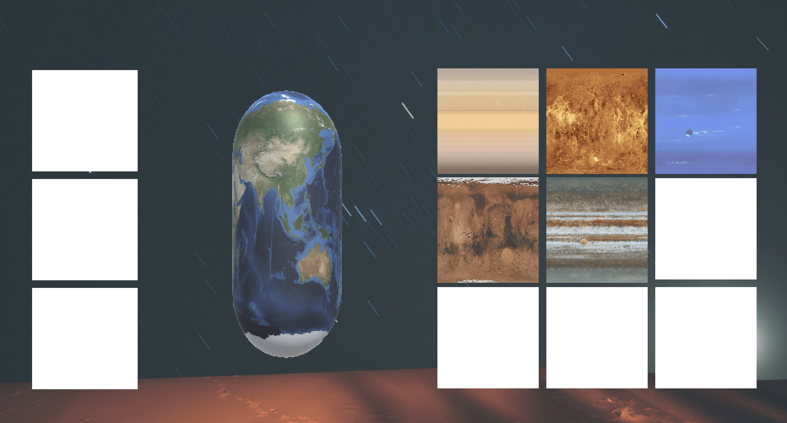
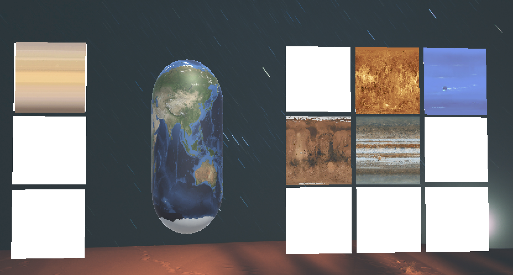
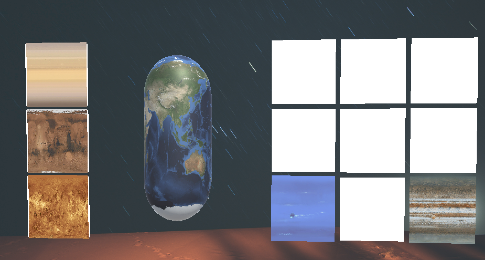
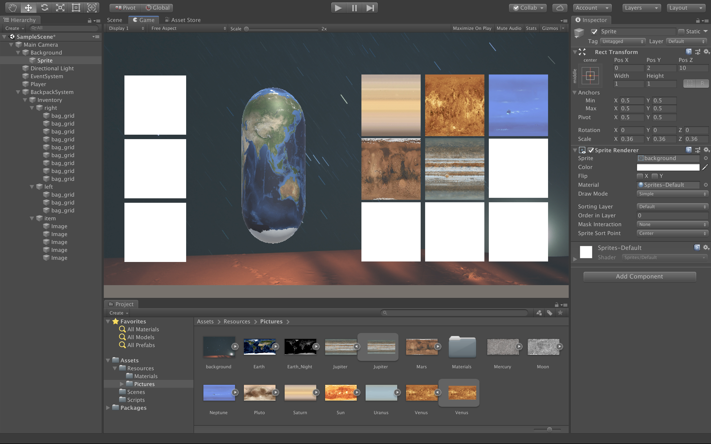

# 3D Game 9 - UI系统

> ***横看成岭侧成峰，远近高低各不同。不识庐山真面目，只缘身在此山中。***
>
> *— 【宋】苏轼 《题西林壁》*

## README

**博客地址：** https://sentimentalswordsman.github.io/2019/11/20/3dG9-UI系统/

**视频地址：** https://www.bilibili.com/video/av76655299/

## UI 系统

### Unity UI 技术概述

UI 即 **User Interface（用户界面）** 的简称。在许多软件中，采用狭义的概念，特指窗体、面板、按钮、文本框等人们熟悉的人机交互元素，及其组织与风格（也称皮肤）。Unity UI 系统采用上述狭义概念。

Unity 目前支持三套完全不同风格的 UI 系统：

- 4.0 及以前 - **IMGUI**（Immediate Mode GUI）及时模式图形界面。它是代码驱动的 UI 系统，没有图形化设计界面，只能在 OnGUI 阶段用 GUI 系列的类绘制各种 UI 元素，因此 UI元素只能浮在游戏界面之上。
- 5.0 及以后 - **Unity GUI / UGUI** 是面向对象的 UI 系统。所有 UI 元素都是游戏对象，友好的图形化设计界面， 可在场景渲染阶段渲染这些 UI 元素。
- 2018.3 及以后 - **UXML**（unity 扩展标记语言）。基于 IMGUI 的 AXML 包装，方便移动应用开发者入门。

### UGUI 基础

**画布**

画布（Cavas）是绘图区域, 同时是 UI 元素的容器。 容器中 ui 元素及其子 UI 元素都将绘制在其上。 拥有Canvas组件的游戏对象都有一个画布，它空间中的子对象，如果是 UI 元素将渲染在画布上。画布区域在场景视图中显示为矩形。这使得定位UI元素变得非常容易，无需随时显示游戏运行视图。

 **UI 布局基础**

每个UI元素都被表示为一个矩形，为了相对于 Canvas 和 其他 UI 元素实现定位，Unity 在 Transform 基础上定义了 RectTransform （矩形变换） 支持矩形元素在 2/3D 场景中变换。

**UI 组件与元素**

UI 部件都是用 Script 开发的自定义组件。包括在 UI、Layout 和 Rendering 等分类。

**圆形遮罩、动画、富文本、血条**

圆形遮罩、动画、富文本、血条等都是菜单制作，初步理解 Text，Image，RowImage，Mask 等的基本使用技巧。

## 作业与练习：UI 效果制作

### 作业要求

进入 [NGUI](http://www.tasharen.com/?page_id=140) 官方网站，使用 UGUI 实现“**Inventory 背包系统**”的效果。

### 预期目标

1. 实现背包系统的右侧，即背包栏，一共3*3个格子，可以存放物品；
2. 实现背包系统的中侧，即用一个物体来表示玩家主体；
3. 实现背包系统的左侧，即佩戴栏，一共1*3个格子，可以佩戴物品；
4. 实现物品的显示，本设计中用图片代替；
5. 实现背包系统界面随鼠标移动而旋转的效果；
6. 实现物体的佩戴、摆放、替换过程。

### 完成情况

**游戏界面1**



**游戏界面2**



**游戏界面3**



### 项目设计

**目录结构**



**完成步骤**

- **结构设计**：使用背景板来构建背包系统的背景；将摄像机作为母对象，并添加EventSystem；使用普通的GameObject来表示玩家主体；使用Canvas来设置BackpackSystem；使用Grid LayOut Group部件来对背包栏和佩戴栏进行布局；用空的Image对象来表示空格子及物品。

- **代码设计1**：对Inventory对象添加脚本以实现随鼠标移动而旋转的效果，只需要获取界面鼠标的位置，并随之改变角度即可，代码如下所示。

- ```C#
  using UnityEngine;
  using System.Collections;
  using System.Collections.Generic;
  
  public class Mouse : MonoBehaviour
  {
      Transform trans;
      Quaternion quaternion;
      public Vector2 lerp = Vector2.zero;
      public Vector2 v2 = new Vector2(4f, 2f);
  
      void Start()
      {
          trans = transform;
          quaternion = trans.localRotation;
      }
  
      void Update()
      {
          Vector3 pos = Input.mousePosition;
          float mywidth = Screen.width * 0.5f;
          float myheight = Screen.height * 0.5f;
          float x = Mathf.Clamp((pos.x - mywidth) / mywidth, -0.5f, 0.5f);
          float y = Mathf.Clamp((pos.y - myheight) / myheight, -0.5f, 0.5f);
          lerp = Vector2.Lerp(lerp, new Vector2(x, y), Time.deltaTime * 2f);
          trans.localRotation = quaternion * Quaternion.Euler(-lerp.y * v2.y, -lerp.x * v2.x, 0f);
      }
  }
  ```

- **代码设计2** ：对表示物体的Image对象添加脚本以实现拖拽的UI效果，需要使用到接口IBeginDragHandler、IDragHandler、IEndDragHandler，代码如下所示。

  ```C#
  using UnityEngine;
  using UnityEngine.UI;
  using UnityEngine.EventSystems;
  using System.Collections;
  using System.Collections.Generic;
  
  public class Drag : MonoBehaviour, IBeginDragHandler, IDragHandler, IEndDragHandler
  {
      Transform trans;
      RectTransform rect_trans;
      CanvasGroup canvas_group;
      GameObject grid = null;
      Color grid_color_1;
      Color grid_color_2 = Color.grey;
      public Vector3 v3;
  
      void Start()
      {
          // Debug.Log("000");
          trans = this.transform;
          v3 = trans.position;
          rect_trans = this.transform as RectTransform;
          canvas_group = GetComponent<CanvasGroup>();
      }
  
      void Update()
      {
      }
  
      public void OnBeginDrag(PointerEventData eventData)
      {
          // Debug.Log("OnBeginDrag");
          canvas_group.blocksRaycasts = false;
          grid = eventData.pointerEnter;
          grid_color_1 = grid.GetComponent<Image>().color;
          v3 = trans.position;
          gameObject.transform.SetAsLastSibling();
      }
  
      public void OnDrag(PointerEventData eventData)
      {
          // Debug.Log("OnDrag");
          bool flag = true;
          Vector3 mouse_position;
          if (RectTransformUtility.ScreenPointToWorldPointInRectangle(rect_trans, eventData.position, eventData.pressEventCamera, out mouse_position))
          {
              rect_trans.position = mouse_position;
          }
          GameObject now_grid_p = eventData.pointerEnter;
          if (now_grid_p == null)
          {
              flag = false;
          }
          else if (now_grid_p.name != "bag_grid")
          {
              flag = false;
          }
          if (flag)
          {
              Image pic = now_grid_p.GetComponent<Image>();
              grid.GetComponent<Image>().color = grid_color_1;
              if (grid != now_grid_p)
              {
                  grid.GetComponent<Image>().color = grid_color_1;
                  grid = now_grid_p;
              }
              pic.color = grid_color_2;
          }
      }
  
      public void OnEndDrag(PointerEventData eventData)
      {
          // Debug.Log("OnEndDrag");
          GameObject now_grid_p = eventData.pointerEnter;
          if (now_grid_p == null)
          {
              trans.position = v3;
          }
          else
          {
              if (now_grid_p.name == "bag_grid")
              {
                  trans.position = now_grid_p.transform.position;
                  v3 = trans.position;
                  now_grid_p.GetComponent<Image>().color = grid_color_1;
              }
              else
              {
                  if (now_grid_p.name == eventData.pointerDrag.name && now_grid_p != eventData.pointerDrag)
                  {
                      Vector3 target_pos = now_grid_p.transform.position;
                      now_grid_p.transform.position = v3;
                      trans.position = target_pos;
                      v3 = trans.position;
                  }
                  else
                  {
                      trans.position = v3;
                  }
              }
          }
          grid.GetComponent<Image>().color = grid_color_1;
          canvas_group.blocksRaycasts = true;
      }
  }
  ```

## 参考资料

[1] [UI系统_教学讲义](https://pmlpml.github.io/unity3d-learning/09-ui.html)

[2] [Maunal](https://docs.unity3d.com/Manual/index.html)

[3]  https://docs.unity3d.com/Manual/UISystem.html